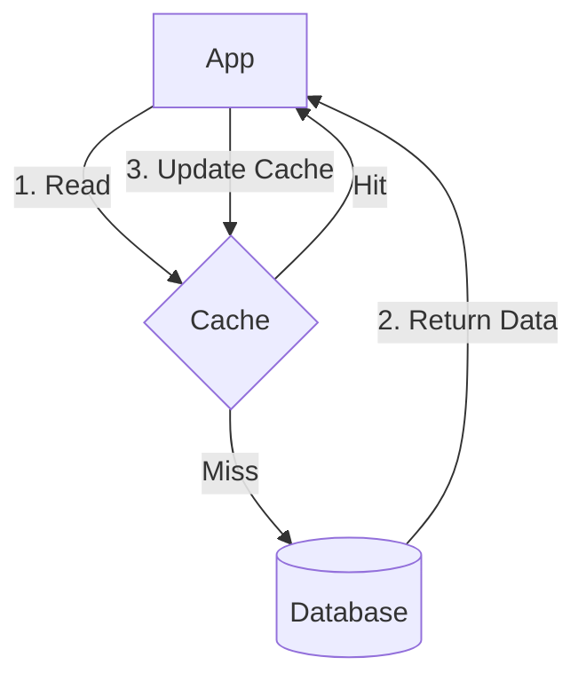

# Caching Strategies with Redis

## Patterns
- **Cache-Aside**: Application checks cache first, if miss, loads from DB and updates cache.
- **Write-Through**: Application writes data to both cache and DB simultaneously.

## Invalidation
Ensure stale data is removed via TTLs or explicit deletion on updates.

## Diagram


## Go Example (Cache-Aside)
```go
package main

import (
    "context"
    "github.com/go-redis/redis/v8"
    "time"
)

var ctx = context.Background()

func getUser(rdb *redis.Client, db Database, userID string) (string, error) {
    val, err := rdb.Get(ctx, userID).Result()
    if err == nil {
        return val, nil // Cache hit
    }

    // Cache miss, fetch from DB
    user, err := db.GetUser(userID)
    if err != nil {
        return "", err
    }

    // Update cache
    rdb.Set(ctx, userID, user, 10*time.Minute)
    return user, nil
}
```
