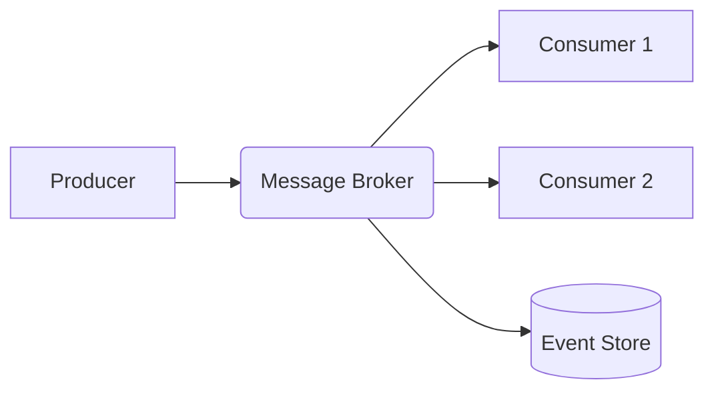

# Event Driven Architecture

## Core Concepts
- **Message Brokering**: Decouples producers and consumers.
- **Event Sourcing**: State is determined by a sequence of events.

## Diagram


## Go Example (Kafka Producer)
```go
package main

import (
    "github.com/confluentinc/confluent-kafka-go/kafka"
    "log"
)

func produceEvent(topic, message string) {
    p, _ := kafka.NewProducer(&kafka.ConfigMap{"bootstrap.servers": "localhost"})
    defer p.Close()

    p.Produce(&kafka.Message{
        TopicPartition: kafka.TopicPartition{Topic: &topic, Partition: kafka.PartitionAny},
        Value:          []byte(message),
    }, nil)
    p.Flush(15 * 1000)
    log.Println("Event produced")
}
```
