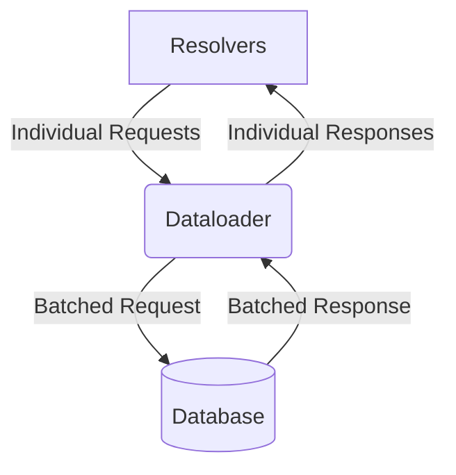

# GraphQL Optimization: Solving N+1

## The N+1 Problem
Without optimization, fetching a list of items and their nested relations results in 1 query for the list and N queries for the relations. 

## Dataloader Solution
Dataloader batches and caches requests to the database.

## Diagram


## Node.js Example (Dataloader)
```javascript
const DataLoader = require('dataloader');

const userLoader = new DataLoader(async (userIds) => {
    // Single DB query for all users
    const users = await db.query('SELECT * FROM users WHERE id IN (?)', [userIds]);
    // Ensure the results match the order of userIds
    const userMap = users.reduce((acc, user) => ({ ...acc, [user.id]: user }), {});
    return userIds.map(id => userMap[id]);
});

// In GraphQL Resolver
const resolvers = {
    Post: {
        author: (post) => userLoader.load(post.authorId)
    }
};
```
