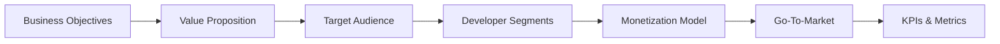
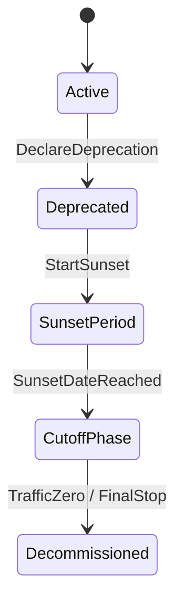

# API Product Strategy & Governance

API strategy defines how an organization leverages APIs to achieve business goals, build developer ecosystems, and create sustainable integration loops. A successful API strategy treats APIs as products, requiring rigorous alignment between business value, developer experience, and governance standards.

---

## API Business & Value Strategy

### API Strategy Canvas
The API Strategy Canvas aligns business objectives with developer needs and technical constraints:



| Dimension | Key Questions | Strategic Focus |
| :--- | :--- | :--- |
| **Business Objectives** | What corporate goals does this API support? | Revenue generation, partner enablement, ecosystem expansion, internal efficiency |
| **Value Proposition** | Why would developers use this API over alternatives? | Speed of integration, reliability, cost efficiency, unique capabilities/data |
| **Target Audience** | Who are the key consumers? | Internal developers, strategic partners, public third-party developers |
| **Developer Segments** | What are the technical profiles of our users? | Indie developers, startup engineering teams, enterprise architects |
| **Monetization Model** | How does the API capture value? | Indirect value, usage-based billing, subscription tiers, revenue share |
| **Go-To-Market** | How do we drive awareness and adoption? | Developer evangelism, SEO/content marketing, integration partnerships |
| **KPIs & Metrics** | How do we measure success? | Time-To-First-Call (TTFC), Monthly Active Developers (MAD), uptime, churn rate |

---

## API Business Models & Financials

Treating the API as a product requires analyzing its cost of goods sold (COGS) and pricing elasticity.

```
API COGS per 1M Requests = (Compute Costs + Data Transfer Costs + LLM/Partner API Costs + Logging/Tracing Overhead)
Gross Margin = (API Price per 1M Requests - API COGS per 1M Requests) / API Price per 1M Requests
```

### Detailed Pricing Model Matrix

| Model | Value Capture Metric | Financial Profile | Best Suited For |
| :--- | :--- | :--- | :--- |
| **Direct Metered / Pay-as-you-go** | Per million API calls, per GB transferred, per compute second | High variable margins, matches costs directly to consumption. | Infrastructure APIs (e.g., Twilio, AWS, Stripe). |
| **Tiered Subscription** | Fixed monthly fee for allocated request volumes (e.g., 50k, 500k calls). | Highly predictable MRR (Monthly Recurring Revenue), lower risk of cost shocks. | SaaS integrations, data feed APIs (e.g., weather, stocks). |
| **Transaction Percentage** | A percentage fee of transaction value flowing through the API. | Massive revenue scale potential, closely aligned to consumer success. | Payment gateways, marketplaces, ordering platforms. |
| **Indirect / Ecosystem** | Zero API fee; value realized through core platform signup/retention. | Harder to attribute directly, but drives customer lifetime value (LTV). | Integrations (e.g., HubSpot, Salesforce, Slack apps). |
| **Freemium** | Free tier for sandbox/dev, paid tiers for production access. | Low initial barrier, drives bottom-up developer adoption. | APIs looking to capture developer mindshare quickly. |

---

## API Product Maturity Model

The maturity of an organization's API program directly correlates with product success and architectural stability:

```
Level 0: No API ────→ Level 1: Internal Ad-Hoc ────→ Level 2: Managed Partners ────→ Level 3: Self-Service Portal ────→ Level 4: Monetized Platform ────→ Level 5: API-First Strategy
```

### Maturity Levels Detail

*   **Level 0: No API**
    *   *Characteristics*: Data shared via DB duplication, FTP exports, or custom file drops.
    *   *Risks*: Zero security control, fragile schema dependencies.
*   **Level 1: Internal Ad-Hoc**
    *   *Characteristics*: Microservices communicating via HTTP/REST, but without documentation, gateways, or key management.
    *   *Risks*: High duplicate effort, tight coupling between teams.
*   **Level 2: Managed Partners**
    *   *Characteristics*: Core APIs exposed via static Swagger docs. Onboarding is manual; keys are distributed via email.
    *   *Risks*: Slow partner velocity, high developer support overhead.
*   **Level 3: Self-Service Portal**
    *   *Characteristics*: Interactive developer portal, automated key provisioning, sandbox environments, and auto-generated SDKs.
    *   *Risks*: Variable developer behavior, lack of standardized rate limits.
*   **Level 4: Monetized Platform**
    *   *Characteristics*: Multi-tenant API gateways, billing engine integrations, usage tracking, and tiered SLA agreements.
    *   *Risks*: Revenue risk on downtime, complex billing reconciliation.
*   **Level 5: API-First Strategy**
    *   *Characteristics*: All company products are built on top of public-facing APIs. Internal teams consume the exact same APIs as external developers (dogfooding). Complete design-first review loops.
    *   *Risks*: Requires deep organizational shift and strict design governance.

---

## API Governance Framework

Governance ensures that APIs remain consistent, secure, performant, and backward-compatible as the organization scales.

### API Council & Design RFC Process

```
Draft OpenAPI Specification ──→ Linter Check (Spectral) ──→ RFC Review by API Council ──→ Sandbox Deployment ──→ Production Release Gate
```

1.  **Drafting**: The product team writes a contract-first OpenAPI 3.1 specification.
2.  **Linting**: Local and CI linting verifies style guidelines before submission.
3.  **RFC Submission**: The spec is submitted to the API Council (cross-functional team of PMs, Security Architects, and Senior Engineers).
4.  **Governance Review**: Council audits the design for:
    *   Naming consistency (plural nouns, snake_case/camelCase).
    *   Security standards (OAuth2, scopes, parameter encryption).
    *   Pagination (Cursor vs Offset) on list endpoints.
    *   Error payload structures (compliance with RFC 7807).
5.  **Release Gate**: Gateways block deployments of APIs not explicitly approved in the API Registry.

---

## Spectral Style Linter Configuration

Enforce API style guidelines programmatically using Spectral rulesets. Below is a production-ready `.spectral.yaml` file:

```yaml
extends: ["spectral:oas3"]
rules:
  # Enforce plural nouns in resource paths
  paths-plural-nouns:
    description: "API paths should use plural nouns for collections (e.g., /users instead of /user)"
    message: "{{property}} should use plural resource naming"
    severity: warn
    given: $.paths[*]~
    then:
      function: pattern
      functionOptions:
        match: "^/([a-z0-9-]+s|v[0-9]+/[a-z0-9-]+s)($|/)"

  # Enforce RFC 7807 Error compliance
  rfc7807-error-responses:
    description: "Error responses (4xx, 5xx) must follow RFC 7807 Problem Details structure"
    severity: error
    given: $.paths[*].responses[?(@property >= 400)]
    then:
      field: content.application/problem+json.schema
      function: defined

  # Limit URI path parameters to snake_case
  path-params-snake-case:
    description: "Path parameters must use snake_case formatting"
    severity: error
    given: $.paths[*].parameters[?(@.in === 'path')]
    then:
      field: name
      function: pattern
      functionOptions:
        match: "^[a-z0-9_]+$"

  # Require pagination parameters on list operations
  list-endpoints-pagination:
    description: "GET operations returning arrays must support pagination parameters"
    severity: warn
    given: $.paths.*.get
    then:
      function: truthy
      given: $.parameters[?(@.name === 'limit' || @.name === 'cursor')]
```

---

## API Deprecation & Decommissioning Playbook

Deprecating APIs requires careful balancing of engineering maintenance cost against customer migration effort.



### Deprecation Policy Execution Checklist

1.  **Announcement Phase (T - 180 Days)**
    *   [ ] Log-scale usage analysis to identify all consumers currently hitting the deprecated version.
    *   [ ] Send customized deprecation warning emails detailing:
        *   The sunset date.
        *   Migration documentation link.
        *   Customized diff analysis showing changes between the current and target versions.
    *   [ ] Inject HTTP Deprecation headers on responses from the deprecated endpoint.

2.  **Sunset Phase (T - 90 Days)**
    *   [ ] Start developer outreach office hours.
    *   [ ] Log-scale alert triggers for consumers who have not reduced traffic.
    *   [ ] Inject Sunset headers with the exact cutoff timestamp.

3.  **Brownout Phase (T - 30 Days)**
    *   [ ] Execute scheduled "brownouts" (temporary API shut-offs for 1 hour, then 6 hours, then 24 hours) to force attention from inactive/unresponsive developers.
    *   [ ] Log brownout failures and follow up with remaining users.

4.  **Cutoff Phase (T - 0 Days)**
    *   [ ] Permanently turn off the endpoint.
    *   [ ] Return `HTTP 410 Gone` with a body pointing to the new API.
    *   [ ] Tear down infrastructure to reclaim compute costs.

<!-- COMPRESSION FOOTER -->
<!--
Compression Level: 5 (Comprehensive architectural references & code details preserved)
Strict compliance with API product strategies, Spectral governance rules, deprecation playbooks, and business models.
-->
