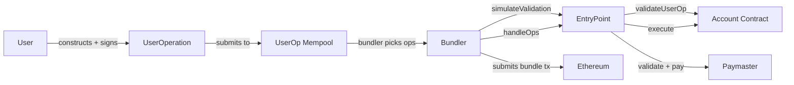
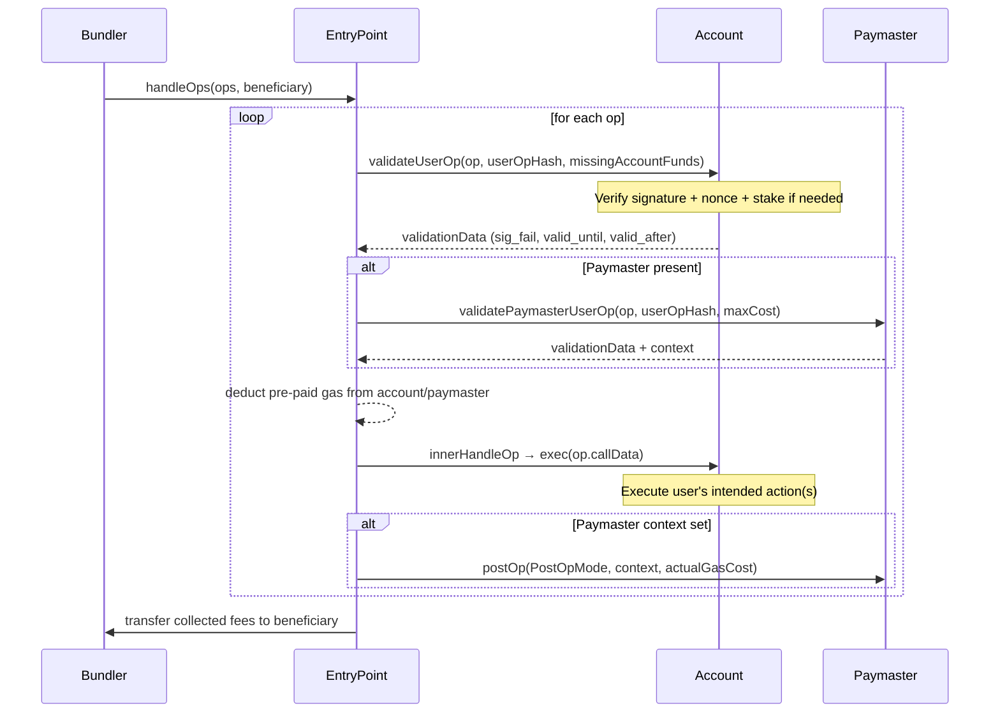

# Account Abstraction (ERC-4337) — Deep Dive

**Status:** Deployed on mainnet (Mar 2023). EntryPoint `0x5FF137D4b0FDCD49DcA30c7CF57E578a026d2789`

---

## Motivation

### EOA Limitations

| Problem | Detail |
|---------|--------|
| Single key control | Lost key = lost assets, no recovery |
| Fixed gas payment | Must hold ETH to pay gas, no ERC-20 gas |
| No batching | Each operation = separate tx, no multicall |
| No spending limits | All or nothing approval |
| No session keys | Cannot delegate limited authority |
| Fixed signature scheme | Only ECDSA secp256k1 |

### Smart Contract Wallets

- EOA: externally owned account (keypair), nonce + sig
- Smart wallet: contract with arbitrary validation logic
- Problem pre-4337: wallet needed a custom relayer per protocol
- ERC-4337: standardized interface so any bundler works with any wallet

### Gas Abstraction

- Paymasters decouple transaction submission from gas payment
- dApps subsidize user gas, ERC-20 gas payments, sponsored transactions
- Users never hold ETH → better UX for onboarding

---

## Architecture



### Components

| Component | Role |
|-----------|------|
| **UserOperation** | Pseudotransaction object signed by user |
| **Alt Mempool** | P2P network of UserOps (not in txpool) |
| **Bundler** | Validates, bundles, submits UserOps to EntryPoint |
| **EntryPoint** | Singleton contract, handles op lifecycle |
| **Account Contract** | User's smart wallet (validate + execute) |
| **Paymaster** | Pays gas on user's behalf (optional) |
| **Aggregator** | Batches signature verification across ops |

---

## UserOperation Structure

```solidity
struct UserOperation {
    address sender;                    // account contract address
    uint256 nonce;                     // anti-replay, sequential or keyed
    bytes initCode;                    // CREATE2 deploy data (empty if deployed)
    bytes callData;                    // ABI-encoded function call(s)
    uint256 callGasLimit;              // gas for execution phase
    uint256 verificationGasLimit;      // gas for validateUserOp
    uint256 preVerificationGas;        // overhead for bundler (tx calldata, etc.)
    uint256 maxFeePerGas;              // max total fee per gas (base + priority)
    uint256 maxPriorityFeePerGas;      // max priority fee per gas
    bytes paymasterAndData;            // paymaster address + context (empty if self-pay)
    bytes signature;                   // user signature (or aggregator signature)
}
```

### Field Details

| Field | Constraints | Notes |
|-------|-------------|-------|
| `sender` | Must be a contract | Derivable via CREATE2 from initCode |
| `nonce` | Sequential per key | `packed = (key << 64) \| sequence` |
| `initCode` | `20 bytes addr + calldata` or empty | First 20 bytes = factory address |
| `callData` | Any ABI | Usually `execute(to, val, data)` or `executeBatch(...)` |
| `callGasLimit` | >= execute cost | Bundler rejects if too low |
| `verificationGasLimit` | >= validateUserOp cost | Must leave 3000 buffer for EntryPoint |
| `preVerificationGas` | Fixed overhead per op | Covers tx intrinsic gas, calldata cost |
| `paymasterAndData` | `20 bytes addr + data` or empty | Empty = account pays own gas |
| `signature` | 65 bytes (ECDSA) or variable | Aggregator may strip/replace |

### Gas Calculation

```
opGas = verificationGasLimit + callGasLimit + preVerificationGas
feePerGas = maxFeePerGas
totalGas = opGas + (calldataCost * calldataBytes)
```

---

## EntryPoint

### Core Functions

```solidity
interface IEntryPoint {
    function handleOps(
        UserOperation[] calldata ops,
        address payable beneficiary
    ) external;

    function handleAggregatedOps(
        UserOpsPerAggregator[] calldata opsPerAggregator,
        address payable beneficiary
    ) external;

    function simulateValidation(
        UserOperation calldata op
    ) external returns (ValidationResult memory);

    function simulateHandleOp(
        UserOperation calldata op,
        address target,
        bytes calldata targetCallData
    ) external returns (ValidationResult memory);
}
```

### `handleOps` Lifecycle



### `handleAggregatedOps`

- Groups ops by aggregator
- Each group: aggregator.aggregateOps(strippedOps) → merged signature
- EntryPoint calls aggregator.validateSignatures(ops, aggregatedSignature)
- Saves gas when multiple accounts share an aggregator

### Simulate Functions

| Function | Purpose |
|----------|---------|
| `simulateValidation` | Dry run `validateUserOp` + `validatePaymasterUserOp`, returns stake info |
| `simulateHandleOp` | Full simulation including execution, caller specifies target override |

- Bundlers MUST call `simulateValidation` before including an op
- Simulation runs against a `_simulationOnlyCall` that disallows storage writes to non-associated slots
- Reverts with `ValidationResult` on success (not an error — intentional revert to return data)

---

## Account Contract

### Required Interface

```solidity
interface IAccount {
    function validateUserOp(
        UserOperation calldata userOp,
        bytes32 userOpHash,
        uint256 missingAccountFunds
    ) external returns (uint256 validationData);
}
```

- `userOpHash`: `keccak256(abi.encode(packed(UserOp, entryPoint, chainId)))`
- `validationData`: packed timestamp bounds + sig failure flag
  - `address(0)` lower 20 bytes = sig verifier (aggregator)
  - Next 6 bytes = `validAfter` (timestamp)
  - Next 6 bytes = `validUntil` (timestamp, 0 = infinite)
  - Top 1 byte = sig failure (1 = reject)

### Minimal Account Contract

```solidity
// SPDX-License-Identifier: MIT
pragma solidity ^0.8.20;

import "@openzeppelin/contracts/utils/cryptography/ECDSA.sol";
import "@account-abstraction/contracts/interfaces/IAccount.sol";
import "@account-abstraction/contracts/core/EntryPoint.sol";

contract SimpleAccount is IAccount {
    using ECDSA for bytes32;

    address public owner;
    IEntryPoint private immutable _entryPoint;

    modifier onlyEntryPoint() {
        require(msg.sender == address(_entryPoint), "only entrypoint");
        _;
    }

    constructor(IEntryPoint entryPoint, address _owner) {
        _entryPoint = entryPoint;
        owner = _owner;
    }

    function validateUserOp(
        UserOperation calldata userOp,
        bytes32 userOpHash,
        uint256 missingAccountFunds
    ) external onlyEntryPoint returns (uint256 validationData) {
        bytes32 hash = userOpHash.toEthSignedMessageHash();
        address recovered = hash.recover(userOp.signature);
        if (recovered != owner) return SIG_VALIDATION_FAILED;
        if (missingAccountFunds > 0) {
            (bool req,) = msg.sender.call{value: missingAccountFunds}("");
            require(req, "pay entrypoint failed");
        }
        return 0; // valid, no time bounds
    }

    function execute(address dest, uint256 value, bytes calldata func)
        external onlyEntryPoint
    {
        (bool success,) = dest.call{value: value}(func);
        require(success, "exec failed");
    }

    function executeBatch(address[] calldata dest, uint256[] calldata value, bytes[] calldata func)
        external onlyEntryPoint
    {
        require(dest.length == func.length, "length mismatch");
        for (uint256 i = 0; i < dest.length; i++) {
            (bool success,) = dest[i].call{value: value[i]}(func[i]);
            require(success, "batch exec failed");
        }
    }

    receive() external payable {}
}
```

### Deployment via CREATE2 (Counterfactual)

```solidity
// Factory
contract AccountFactory {
    function createAccount(address owner, uint256 salt) public returns (address) {
        return address(new SimpleAccount{salt: bytes32(salt)}(entryPoint, owner));
    }

    function getAddress(address owner, uint256 salt) public view returns (address) {
        bytes32 bytecode = keccak256(
            abi.encodePacked(
                type(SimpleAccount).creationCode,
                abi.encode(entryPoint, owner)
            )
        );
        bytes32 hash = keccak256(
            abi.encodePacked(
                bytes1(0xff), address(this), salt, bytecode
            )
        );
        return address(uint160(uint256(hash)));
    }
}
```

- `initCode` = `abi.encodePacked(factory, factory.createAccount.selector, owner, salt)`
- EntryPoint deploys via CREATE2, address must match `sender`
- Wallet exists only at the counterfactual address — zero-cost creation until first use

---

## Paymaster

### Interface

```solidity
interface IPaymaster {
    function validatePaymasterUserOp(
        UserOperation calldata userOp,
        bytes32 userOpHash,
        uint256 maxCost
    ) external returns (bytes memory context, uint256 validationData);

    function postOp(
        PostOpMode mode,
        bytes calldata context,
        uint256 actualGasCost
    ) external;
}
```

### Paymaster Types

| Type | Mechanism | Gas Cost | Trust Assumption |
|------|-----------|----------|------------------|
| **Standard (Verifying)** | Off-chain signature, paymaster deposits ETH | Low | User trusts paymaster sig oracle |
| **ERC-20 Token** | Paymaster swaps user tokens, covers gas | High (swap + transfer) | User trusts paymaster & oracle |
| **Sponsor (dApp)** | Paymaster covers all gas, no user cost | Medium | dApp trusts users (rate limit) |
| **Post-op** | Executes post-operation logic (e.g. token mint) | Medium | None extra |

### Minimal Verifying Paymaster

```solidity
// SPDX-License-Identifier: MIT
pragma solidity ^0.8.20;

import "@account-abstraction/contracts/core/BasePaymaster.sol";

contract SimplePaymaster is BasePaymaster {
    using ECDSA for bytes32;

    address public signer;

    constructor(IEntryPoint entryPoint, address _signer)
        BasePaymaster(entryPoint)
    {
        signer = _signer;
    }

    function _validatePaymasterUserOp(
        UserOperation calldata userOp,
        bytes32 userOpHash,
        uint256 maxCost
    ) internal override returns (bytes memory context, uint256 validationData) {
        (bytes memory signature) = abi.decode(
            userOp.paymasterAndData[20:], (bytes)
        );
        bytes32 hash = _getHash(userOp, maxCost).toEthSignedMessageHash();
        if (hash.recover(signature) != signer) {
            return ("", SIG_VALIDATION_FAILED);
        }
        return ("", 0); // valid
    }

    function _getHash(UserOperation calldata userOp, uint256 maxCost)
        internal view returns (bytes32)
    {
        return keccak256(abi.encode(
            userOp.sender, userOp.nonce, keccak256(userOp.callData),
            maxCost, block.chainid, address(this)
        ));
    }
}
```

### Paymaster Staking

- EntryPoint requires paymasters to stake ETH (deposit + unstake delay)
- Ensures paymasters can't grief bundlers by validating then refusing payment
- `addStake(uint32 unstakeDelaySec)` — stake grows linearly
- `withdrawStake()` — post-delay withdrawal
- Minimum: 1 wei deposit + 1 sec delay (practical: 1 ETH + 1 day delay)

---

## Aggregator

```solidity
interface IAggregator {
    function validateUserOpSignature(UserOperation calldata userOp)
        external view returns (bytes memory signature);

    function aggregateSignatures(
        UserOperation[] calldata userOps
    ) external view returns (bytes memory aggregatedSignature);

    function validateSignatures(
        UserOperation[] calldata userOps,
        bytes calldata signature
    ) external view returns (bool);
}
```

- Aggregator collects signatures from many accounts, produces one aggregated sig
- **BLS aggregator**: multiple BLS sigs → one group sig (ideal for validator sets)
- **ECDSA aggregator**: batch verification (less efficient but no curve change)
- EntryPoint calls `aggregateSignatures` then `validateSignatures` once per batch
- Saves: N individual ecrecover → 1 batch verification

---

## Security

### Replay Protection

| Dimension | Mechanism |
|-----------|-----------|
| **Nonce** | Sequential per key, prevents tx-order replay |
| **Chain ID** | `userOpHash` includes `block.chainid` |
| **EntryPoint** | UserOpHash unique per entryPoint address |
| **Paymaster context** | Paymasters include validUntil/validAfter timestamps |
| **Aggregator binding** | Sig includes aggregator address |

### Signature Validation

- `validateUserOp` must check `userOpHash` domain separator
- Use `ECDSA.tryRecover` or `ecrecover` — never `tx.origin` for auth
- Avoid: signature malleability (use OpenZeppelin's ECDSA)

### Reentrancy (Cross-Function)

| Attack | Mitigation |
|--------|------------|
| Re-enter `handleOps` from `validateUserOp` | EntryPoint locks per sender (nonce-based ordering) |
| Re-enter from execution | Staked paymaster, no state changes during validation |
| Storage collisions | Simulation disallows writes to non-associated slots |
| Delegatecall to arbitrary | Account contract must restrict to trusted targets |

### Storage Access Rules (Simulation)

During `simulateValidation`:

- Account may write to its own storage
- Account may read any storage
- Account may NOT write to another contract's storage (unless associated via ERC-1967 proxy pattern)
- Access to sender's own address, entry point, paymaster, aggregator is free
- Violation → bundler rejects op (gas estimation is unreliable)

---

## Alt Mempool

### Flashbots p2p Mempool

- Separate p2p network for UserOperations (not in public txpool)
- Bundlers subscribe, relay valid UserOps
- Reputation-based pricing:
  - Bundlers score ops by profitability
  - Ops with higher `maxPriorityFeePerGas` → prioritized
  - Stale ops (expired validUntil) are pruned
- MEV protection: ops not visible to searchers/mev bots until bundled

### Reputation Scoring

```
score = (premium * gasLimit) / (verificationCost + executionCost)
```

- Bundlers maintain per-entity reputation (sender, paymaster, factory)
- Entities that submit invalid ops repeatedly are throttled or banned
- Cooldown: reputation decays over time

---

## Deployment Patterns

### Counterfactual (CREATE2) Flow

1. User computes wallet address off-chain via factory
2. User signs UserOperation with `initCode`
3. Bundler calls `handleOps` → EntryPoint deploys via factory → calls `validateUserOp`
4. Wallet is deployed at pre-computed address, no separate deploy tx needed

### Key Delegation

- `validateUserOp` can use any signature scheme: ECDSA, BLS, WebAuthn (passkeys)
- Threshold signatures: require M-of-N signers
- Session keys: EIP-7702 delegation, temporary keypairs with scoped permissions
- Social recovery: guardians vote to rotate owner via delayed execution

### Upgradeable Wallets

```solidity
// Proxy (UUPS or Beacon)
contract UpgradeableAccount is IAccount, UUPSUpgradeable {
    address public owner;
    function validateUserOp(...) external onlyProxy {
        // delegate to implementation
    }
    function _authorizeUpgrade(address) internal override onlyOwner {}
}
```

- UUPS: implementation in wallet, cheaper per-call
- Beacon: shared implementation, cheaper deployment
- Storage layout: must remain compatible across upgrades

---

## Wallet Examples

| Project | Key Features |
|---------|-------------|
| **ZeroDev** | Kernel-based, session keys, ERC-20 gas, social recovery |
| **Biconomy** | Nexus, multi-chain, bundler-as-a-service, gas station |
| **StackUp** | Paymaster API, fiat on-ramp, dApp sponsorship |
| **Kernel** | Modular (plugins), signature aggregation, EIP-6900 compatible |
| **Safe{Core}** | Multisig + 4337, Zodiac modules, relay SDK |

### Adoption Metrics (2025)

- Total UserOperations: 500M+
- Active accounts: 10M+
- Leading chains: Ethereum mainnet, Arbitrum, Optimism, Polygon, Base

---

## Solidity Code: Minimal Account + Paymaster

Full minimal account contract and paymaster samples are shown above in their respective sections. Key integration pattern:

```solidity
// Bundler-side: submit a single op
UserOperation memory op = UserOperation({
    sender: accountAddr,
    nonce: 0,
    initCode: initCode,   // "" if deployed
    callData: abi.encodeWithSelector(
        SimpleAccount.execute.selector, dest, 0, data
    ),
    callGasLimit: 50000,
    verificationGasLimit: 100000,
    preVerificationGas: 21000 + 1600 * calldataLen,
    maxFeePerGas: 10 gwei,
    maxPriorityFeePerGas: 1 gwei,
    paymasterAndData: "", // self-pay
    signature: sign(userOpHash, key)
});

// Bundler calls handleOps
entryPoint.handleOps([op], beneficiary);
```

### EntryPoint Deposit

```solidity
// Account pays EntryPoint in advance for gas
entryPoint.depositTo{value: 1 ether}(accountAddr);
// Or Paymaster deposits
entryPoint.depositTo{value: 10 ether}(paymasterAddr);
// Withdraw
entryPoint.withdrawTo(payable(owner), amount);
```

- `getDepositInfo(address)`: returns deposit, staked, unstake delay sec
- Accounts/paymasters MUST pre-deposit or pay during `validateUserOp` via `missingAccountFunds`
