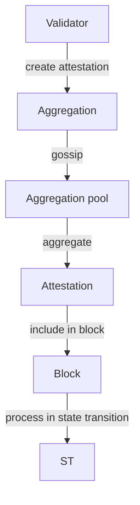

# Ethereum Consensus Layer — Beacon Chain

## Slot & Epoch Structure

```
Slot       = 12 seconds
Epoch      = 32 slots = 384 seconds ≈ 6.4 minutes
Epoch boundary = first slot of each epoch
```

```
slot_0      slot_1      ...  slot_31        slot_32
[  epoch 0   ][            ][  epoch 1   ][
|--12s--|--12s--|--12s--|--12s--|--12s--|--12s--|
```

## Committees

- Validators shuffled into committees per epoch
- Each committee assigned to a slot
- Committee size: `target_committee_size = 128` (minimum `MAX_VALIDATORS_PER_COMMITTEE = 2048`)
- `get_beacon_committee(state, slot, index)` returns validator indices

## Casper FFG — Finality

Casper FFG uses **checkpoints** (epoch boundary blocks) and **votes** (attestations):

| Concept | Description |
|---------|-------------|
| Source | Last justified checkpoint |
| Target | Current epoch boundary |
| Justified | Checkpoint with 2/3 of validators attesting *source→target* |
| Finalized | Direct child of a justified checkpoint that gets justified |

### Justification & Finalization Rules

```
if epoch(source) == epoch(target):
    # No new justification
elif epoch(target) == epoch(source) + 1 and 2/3 votes link source→target:
    target becomes justified
    if source was already justified:
        source is finalized
elif epoch(target) > epoch(source) + 1:
    must justify intermediate checkpoints first
```

### Pseudo-code: `should_update_justification`

```python
def process_justification_and_finalization(state: BeaconState) -> None:
    if get_current_epoch() <= GENESIS_EPOCH + 1:
        return
    old_justified = state.current_justified_checkpoint
    # Track total active balance
    balances = get_active_balance(state)
    # Check current and previous epoch
    for epoch in [get_previous_epoch(), get_current_epoch()]:
        if epoch in [GENESIS_EPOCH, GENESIS_EPOCH + 1]:
            continue
        bits = state.previous_epoch_attestations if epoch == get_previous_epoch() else state.current_epoch_attestations
        matching_target = sum(att.aggregation_bits * att.effective_balance)
        if matching_target * 3 >= balances * 2:
            checkpoint = Checkpoint(epoch=epoch, root=get_block_root(state, epoch))
            state.current_justified_checkpoint = checkpoint
```

## LMD-GHOST Fork Choice

**Latest Message Driven — Greediest Heaviest Observed SubTree**

```
head = start_root
for each slot in [current_slot - 1, ..., 0]:
    children = get_children(head)
    if no children: break
    scores = {}
    for child in children:
        # Weight = sum of effective balances of validators whose latest
        # attestation is in this subtree
        scores[child] = sum(get_effective_balance(v) for v in get_latest_attestations_in_subtree(child))
    head = argmax(scores)
return head
```

### `get_head` Implementation Sketch

```python
def get_head(store: Store) -> Root:
    # Walk down from justified checkpoint root
    head = store.justified_checkpoint.root
    justified_slot = compute_start_slot_at_epoch(store.justified_checkpoint.epoch)
    while True:
        children = get_children(store, head)
        if not children:
            return head
        # Filter to descendants of head at current slot
        head = max(
            children,
            key=lambda c: get_weight(store, c, justified_slot)
        )

def get_weight(store: Store, root: Root, justified_slot: Slot) -> int:
    # Sum of effective balances of validators attesting to root or its descendants
    return sum(
        state.validators[i].effective_balance
        for i, vote in store.latest_messages.items()
        if is_descendant(store, vote.root, root) and vote.slot >= justified_slot
    )
```

## Attestation Flow



Attestation data:
- `slot`, `index` (committee)
- `beacon_block_root` (LMD-GHOST vote)
- `source` checkpoint, `target` checkpoint (Casper FFG vote)

## Block Proposal Flow

```python
def get_block_proposal(state, slot, proposer_index):
    # 1. Run randao reveal
    randao_reveal = proposer.sign(get_epoch_seed(state, slot))
    # 2. Select beacon block body
    body = BeaconBlockBody(
        randao_reveal=randao_reveal,
        eth1_data=get_eth1_vote(state),        # deposit contract data
        graffiti="opencode-ethereum-skill",
        proposer_slashings=[],                  # max 16
        attester_slashings=[],                  # max 2
        attestations=pending_attestations,      # max 128
        deposits=[],
        voluntary_exits=[],
        sync_aggregate=get_sync_aggregate(state),
        execution_payload=get_execution_payload(state),  # post-merge
        blob_kzg_commitments=[]                 # post-4844
    )
    return BeaconBlock(slot=slot, proposer_index=proposer_index, parent_root=parent, state_root=root, body=body)
```

## Slashing Conditions

| Condition | Type | Description |
|-----------|------|-------------|
| Double vote | `PROPOSER_SLASHING` | Two attestations with same target epoch, different blocks |
| Surround vote | `ATTESTER_SLASHING` | Attestation A's source < B's source < B's target < A's target |
| Proposer slashing | `PROPOSER_SLASHING` | Proposer signs two different blocks at same slot |

### Slashing Penalty Calculation

```python
slashed_balance = validator.effective_balance
whistleblower_reward = slashed_balance // WHISTLEBLOWER_REWARD_QUOTIENT  # 512
validator.effective_balance -= whistleblower_reward
# Correlation penalty (applied later at epoch boundary):
correlation_penalty = min(
    slashed_balance * 3,
    total_balance // 64  # ~1.56% of total stake
)
```

## Validator Lifecycle

```
Deposit → Pending → Activation (after 4 epochs) → Active → 
  [Slashed → Exited] or [Voluntary Exit → Exited] → Withdrawal
```

### Withdrawal Credentials

| Prefix | Type | Description |
|--------|------|-------------|
| `0x00` + BLS pubkey (47 bytes) | BLS withdrawal | Legacy, must update |
| `0x01` + 0x00*11 + execution_address (20 bytes) | Execution withdrawal | Enables automatic withdrawals |

### Phase Timeline

| Phase | Epoch | Description |
|-------|-------|-------------|
| Phase 0 | 0 | Beacon chain genesis (Dec 2020) |
| Phase 1 | — | Merged into merge (sharding deferred) |
| Bellatrix | 144896 | Merge: EL + CL combined (Sep 2022) |
| Capella | 194048 | Withdrawals enabled (Apr 2023) |
| Deneb | 269568 | EIP-4844 blobs (Mar 2024) |
| Electra | TBD | PeerDAS, max EB adjustments |

### Sync Committee

- 512 validators per sync committee period (256 epochs ≈ 27 hours)
- Signs `block_root` of current slot
- Light clients verify BLS signature against sync committee pubkey
- Updated every sync committee period
- Reduces light client overhead: no need to track full validator set

### Spec References

- https://github.com/ethereum/consensus-specs — `specs/phase0/`, `specs/altair/`, `specs/bellatrix/`, etc.
- Core types: `BeaconState`, `BeaconBlock`, `Attestation`, `Checkpoint`
- Python executable spec reference implementation in `specs/`

### Fork Choice After Merge

The EL provides `ForkChoiceState` (head block hash, finality, safe). The CL runs `get_head` incorporating both LMD-GHOST weights AND the EL's fork choice:

```
head = get_head(store)  # CL fork choice
el_head = execution_engine.get_head()  # EL fork choice
assert is_descendant(el_head, head)  # Consistency check
```
