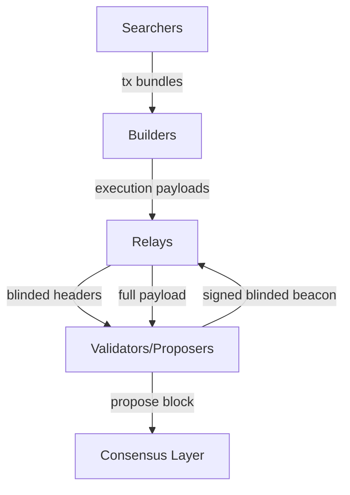
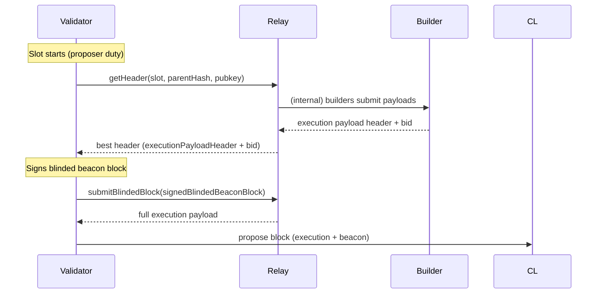
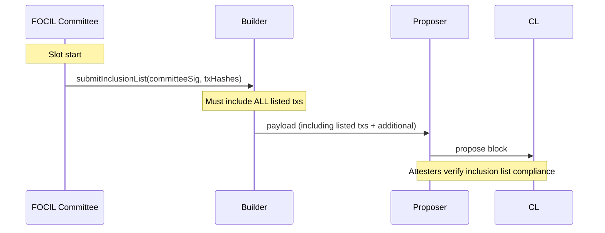
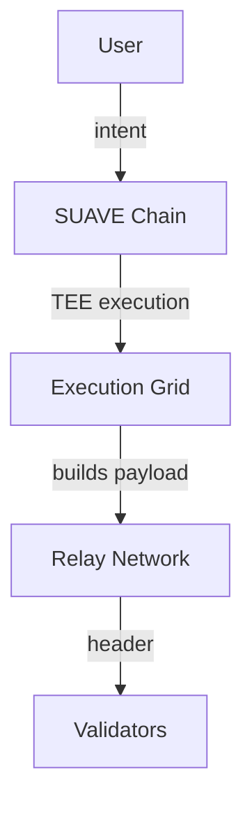
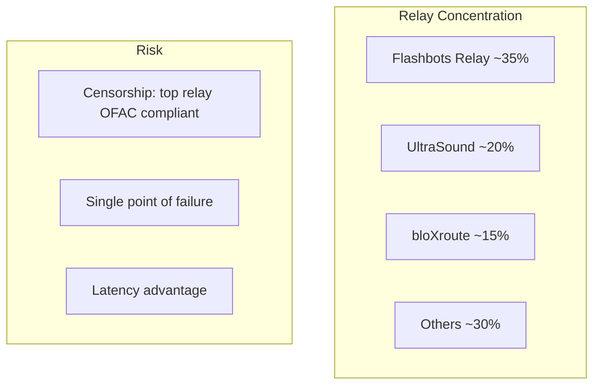

# Proposer-Builder Separation & MEV-Boost — Deep Dive

---

## The MEV Supply Chain



### Pipeline Roles

| Role | Function | Incentive |
|------|----------|-----------|
| **Searcher** | Finds MEV opportunities, constructs tx bundles | MEV profit |
| **Builder** | Assembles full execution payloads from bundles + public txs | Builder payment (bid - bundle cost) |
| **Relay** | Forwards blinded headers, stores full payloads | Relay fee (optional) |
| **Proposer (Validator)** | Selects highest-bidding header, signs blinded beacon | MEV-Boost payment |
| **User** | Submits normal transactions | Transaction inclusion |

### Value Flow

```
Searcher profit: $100
  └─ Bundle bid to builder: $90
       └─ Builder bid to proposer via relay: $85
            └─ Validator receives: $85 (net new revenue)
                 └─ MEV distributed: [$85 to solo, smoothed in pools]
```

---

## MEV-Boost Architecture

### Protocol Flow



### Relay API

Ethereum Builder Specification (EBS): `https://github.com/flashbots/builder`

#### `GET /eth/v1/builder/header/{slot}/{parent_hash}/{pubkey}`

Returns `GetHeaderResponse`:

```json
{
  "version": "bellatrix",
  "data": {
    "header": {
      "slot": "100",
      "proposer_index": "5000",
      "parent_hash": "0x...",
      "state_root": "0x...",
      "body_root": "0x...",
      "execution_payload_header": {
        "block_hash": "0x...",
        "transactions_root": "0x...",
        "withdrawals_root": "0x...",
        "block_number": "20000000",
        "gas_limit": "30000000",
        "gas_used": "15000000",
        "timestamp": "1700000000",
        "base_fee_per_gas": "50000000000",
        "extra_data": "0x...",
        "excess_blob_gas": "0",
        "blob_gas_used": "0"
      }
    },
    "value": "1000000000000000000"
  }
}
```

- `value`: bid in wei (proposer payment)
- `execution_payload_header`: 32-byte commitments without the body

#### `POST /eth/v1/builder/blinded_blocks`

Proposer submits signed blinded beacon block + execution payload header:

```json
{
  "message": {
    "slot": "100",
    "proposer_index": "5000",
    "parent_root": "0x...",
    "state_root": "0x...",
    "body": {
      "randao_reveal": "0x...",
      "eth1_data": { ... },
      "graffiti": "0x...",
      "proposer_slashings": [],
      "attester_slashings": [],
      "attestations": [],
      "deposits": [],
      "voluntary_exits": [],
      "sync_aggregate": { ... },
      "execution_payload_header": { ... }
    }
  },
  "signature": "0x..."
}
```

Relay responds with full `ExecutionPayload` (all transactions, withdrawals, blobs).

#### `POST /eth/v1/builder/validators`

Registers proposer with relay (called once per epoch):

```json
{
  "message": {
    "pubkey": "0x...",
    "fee_recipient": "0x...",
    "gas_limit": "30000000",
    "timestamp": "1700000000"
  },
  "signature": "0x..."
}
```

#### Builder API

| Endpoint | Direction | Purpose |
|----------|-----------|---------|
| `GET /relay/v1/data/bidtrace` | Relay→Builder | Bid history |
| `POST /relay/v1/builder/blocks` | Builder→Relay | Submit payload + bid |
| `GET /relay/v1/builder/validators` | Builder→Relay | Get registered validators this slot |

### Blinded Beacon Block

- Beacon block body has `execution_payload_header` (32-byte commitments) instead of full `execution_payload`
- Proposer signs blinded block, sends to relay
- Relay substitutes full payload, forwards to proposer
- Proposer broadcasts fully resolved block to network

---

## Relays

### Production Relays (2025)

| Relay | Operator | Market Share | Censorship Policy | Notes |
|-------|----------|-------------|-------------------|-------|
| **Flashbots** | Flashbots | ~30% | OFAC compliant (censors OFAC-sanctioned addresses) | Largest, most reliable |
| **UltraSound** | Blocknative | ~15% | Permissionless (no censorship) | Open, community-run |
| **Agnostic** | Agnostic | ~10% | Permissionless | Non-custodial relay design |
| **Titan** | Titan | ~8% | Permissionless | Regional diversity (Asia) |
| **bloXroute Max Profit** | bloXroute | ~12% | Varies by region | Low latency, global nodes |
| **Eden** | Eden Network | ~5% | Permissionless | MEV protection |

### Relay Trust Model

Relays are **custodians** of execution payloads during the blinded period:

| Risk | Description | Mitigation |
|------|-------------|------------|
| Relay withholds payload | Proposer signs blinded block, relay never reveals payload | Slashing risk if proposer proposes empty block |
| Relay reveals payload early | Searchers see txs before block is proposed | Reputation loss, no on-chain penalty |
| Relay censors | Relay refuses to forward certain bundles | Proposer chooses permissionless relays |
| Relay disappears mid-slot | Payload lost, proposer misses slot | Multi-relay redundancy (mev-boost relays flag) |

### Multi-Relay Setup

```yaml
# mev-boost configuration
-mev-boost-relays:
  - https://0x...@boost-relay.flashbots.net
  - https://0x...@relay.ultrasound.money
  - https://0x...@agnostic-relay.net
```

- `mev-boost` queries all relays in parallel at slot start
- Selects highest bid among all responses
- Proposer redundancy: if selected relay fails, proposer falls back to local builder

---

## PBS Variants

### External PBS (Current — MEV-Boost)

- Out-of-protocol: relay/builder layer is off-chain middleware
- Validators opt-in by running `mev-boost` sidecar
- **Pro**: rapid iteration, no protocol change, permissionless innovation
- **Con**: relay centralization risk, extra trust assumption, governance complexity

### ePBS (Enshrined PBS — Future Protocol)

- In-protocol: builder commitments, execution tickets, in-protocol auction
- Proposers no longer run execution clients — only consensus
- Execution tickets: validators pre-commit to proposer slots, builders bid for rights

#### ePBS Design Options

| Component | Design A (Execution Tickets) | Design B (Execution Auctions) |
|-----------|------------------------------|-------------------------------|
| Proposer selection | Ticket holders pre-committed | Per-slot auction |
| Builder payment | Ticket price set by protocol | Auction bid (market) |
| Trust assumption | No relay needed | No relay needed |
| Censorship resistance | Inclusion lists (FOCIL) | Inclusion lists (FOCIL) |
| Complexity | Moderate | High (auction timing) |

#### Builder Override

- Even in ePBS, proposer may override the winning builder if:
  - Builder payload is invalid
  - Builder fails to reveal in time
  - Proposer has higher-value private order flow
- "Lot" vs "first-price" auction dynamics

---

## Inclusion Lists

### FOCIL (First-Come Inclusion List)

- **Problem**: Builder controls tx ordering, can censor specific addresses
- **FOCIL solution**: Committee of attesters submit inclusion lists before builder builds
- Inclusion list = unordered set of tx hashes that MUST be included
- Builder may add additional txs, but cannot omit listed txs



### Committee Structure

| Parameter | Value |
|-----------|-------|
| Committee size | TBD (32–128 validators) |
| Selection | Random per slot from active validators |
| List deadline | Before builder seal |
| Penalty | Missing committee duty = lower effectiveness |

### Builder Neutrality

- Builder may reorder within inclusion list (MEV extraction still possible)
- Inclusion list guarantees **censorship resistance** but not **fair ordering**
- FOCIL + ePBS: builder cannot censor, only reorder

---

## SUAVE (Flashbots Decentralized Builder)

### Architecture



### TEE-Based Execution

- **Trusted Execution Environment**: Intel SGX / TDX, AMD SEV-SNP
- Builders run inside TEE: code and data encrypted, operator cannot inspect
- Searchers submit encrypted bundles → TEE decrypts → matches intents → builds payload
- Verifiable: remote attestation proves TEE integrity

### Intent Matching

```
User intent: "swap 10 ETH for USDC at ≥ 3400 USDC"
Searcher A: "backrun with 5 ETH buy"
Searcher B: "sandwich the swap"
TEE: executes at block building → selects optimal path
```

- Cross-domain intents: Ethereum + L2s, Solana, etc.
- Privacy: intents and order flow never visible to builder operator

### Key Properties

| Property | SUAVE | Current MEV-Boost |
|----------|-------|-------------------|
| Privacy | Encrypted (TEE) | Visible to relay/builder |
| Decentralization | Multi-operator TEE network | Centralized relays |
| Cross-domain | Native | Ethereum only |
| Trust | Hardware TEE | Social/legal (relays) |
| Maturity | Early (testnet) | Production |

---

## MEV Distribution

### MEV-Share (Flashbots)

- Searchers bid for order flow from users
- User signs `mev-share` bundle: "I authorize this tx + conditions"
- Searcher competes to include, user gets rebate (up to 90% of MEV)
- Refund mechanism: builder pays user directly via coinbase transfer

```
User tx: swap 100 ETH → USDC
Searcher wins: pays 0.1 ETH as bid
MEV extracted: 0.3 ETH
User gets: 0.27 ETH (90% rebate)
Builder gets: 0.03 ETH
```

### MEV Smoothing (Staking Pools)

- Lido, Rocket Pool, and other staking pools aggregate MEV across all validators
- **Smoothing pool**: MEV rewards averaged over all depositors, no lottery effect
- Without smoothing: validator A gets 1 ETH MEV, validator B gets 0.01 ETH MEV
- With smoothing: both get 0.505 ETH (minus pool fee)

| Pool | Smoothing Mechanism | Fee |
|------|---------------------|-----|
| Lido (stETH) | Protocol-level MEV distribution | 10% on staking rewards |
| Rocket Pool (rETH) | Minipool operator gets MEV, smoothed via oracle | 14% commission |
| StakeWise | Separate smoothing pool contract | 5% |

### Order Flow Auctions

- **Permissioned order flow**: dApps/Apps sell user tx flow to builders
- **Private order flow**: users send txs directly to builders (bypass public mempool)
- **Order flow auctions**: multiple builders bid for exclusive access to order flow
- Implication: public mempool becomes less relevant, power shifts to builders with best order flow

---

## Economic Analysis

### Validator Revenue Breakdown

```
Total block reward:
├── Issuance (consensus layer): ~0.5 ETH/day per validator
├── Priority fees (execution): ~0.05 ETH/day
└── MEV (builder payments):   ~0.1–0.5 ETH/day (highly variable)
```

| Condition | Issuance ETH/day | Priority ETH/day | MEV ETH/day |
|-----------|-----------------|------------------|-------------|
| Low MEV | 0.50 | 0.03 | 0.05 |
| Normal | 0.50 | 0.05 | 0.15 |
| High MEV (e.g., sandwich, liquidation) | 0.50 | 0.10 | 1.50 |

- MEV constitutes 10–60% of validator revenue depending on market conditions
- MEV revenue is right-skewed: 90% of MEV goes to ~10% of validators (those who win proposer lottery in high-value slots)

### Centralized Relay Risk



- Top 3 relays control >60% of validated block value
- Flashbots relay censors OFAC-sanctioned addresses → permissionless relays exist but smaller
- **MEV centralization**: builders with best order flow win more auctions → network effects → oligopoly

### Censorship Resistance

| Metric | Value (2025) |
|--------|-------------|
| Blocks following OFAC rules | ~50% |
| Permissionless relay share | ~40% |
| Estimated censored txs | <1% (but growing) |
| FOCIL adoption | Not live (planned with ePBS) |

- Censorship is address-level, not transaction-type level
- Tornado Cash addresses most commonly censored
- Permissionless relays (UltraSound, Agnostic) provide un-censored alternative

---

## Code: Relay Interaction with curl

### Get Header (Proposer)

```bash
# Query relay for best header
curl -s "https://boost-relay.flashbots.net/eth/v1/builder/header/100/0x$(head -c 64 /dev/urandom | xxd -p)/0x$(head -c 64 /dev/urandom | xxd -p)" | jq .

# Response
{
  "version": "bellatrix",
  "data": {
    "header": {
      "execution_payload_header": {
        "block_hash": "0xabc...",
        "block_number": "20000000"
      }
    },
    "value": "850000000000000000"
  }
}
```

### Submit Blinded Block (Proposer)

```bash
# Proposer signs blinded beacon block and sends to relay
curl -s -X POST \
  -H "Content-Type: application/json" \
  -d '{
    "message": {
      "slot": "100",
      "proposer_index": "5000",
      "parent_root": "0x...",
      "state_root": "0x...",
      "body": {
        "execution_payload_header": {
          "block_hash": "0xabc..."
        }
      }
    },
    "signature": "0x..."
  }' \
  "https://boost-relay.flashbots.net/eth/v1/builder/blinded_blocks" | jq .
```

### Submit Block (Builder)

```bash
# Builder submits execution payload + bid to relay
curl -s -X POST \
  -H "Content-Type: application/json" \
  -d '{
    "execution_payload": {
      "parent_hash": "0x...",
      "fee_recipient": "0x...",
      "state_root": "0x...",
      "receipts_root": "0x...",
      "logs_bloom": "0x...",
      "block_number": "20000000",
      "gas_limit": "30000000",
      "gas_used": "15000000",
      "timestamp": "1700000000",
      "extra_data": "0x",
      "base_fee_per_gas": "50000000000",
      "block_hash": "0x...",
      "transactions": ["0x...", "0x..."],
      "withdrawals": []
    },
    "signature": "0x...",
    "message": {
      "slot": "100",
      "parent_hash": "0x...",
      "builder_pubkey": "0x...",
      "proposer_index": "5000"
    }
  }' \
  "https://boost-relay.flashbots.net/relay/v1/builder/blocks" | jq .
```

### Builder Integration (Go — Pseudocode)

```go
type Builder struct {
    relayURL string
    mempool  *Mempool
    searcher *SearcherClient
}

func (b *Builder) BuildPayload(slot uint64, parentHash common.Hash) (*ExecutionPayload, error) {
    bundles := b.searcher.GetBundles(slot)
    publicTxs := b.mempool.GetTxs(slot)

    payload := b.assembleBlock(bundles, publicTxs)
    bid := b.calculateBid(payload) // profit - minimum margin

    header := &ExecutionPayloadHeader{
        BlockHash: payload.BlockHash(),
        BlockNumber: payload.Number,
        GasUsed: payload.GasUsed,
    }

    resp, err := http.Post(
        b.relayURL + "/relay/v1/builder/blocks",
        "application/json",
        json.Marshal(BuilderSubmission{
            Payload: payload,
            Bid:     bid,
            Slot:    slot,
        }),
    )
    return payload, err
}
```

### MEV-Boost Configuration

```bash
# Start mev-boost sidecar (validator companion)
./mev-boost \
  -relays "https://0xabc...@boost-relay.flashbots.net,https://0xdef...@relay.ultrasound.money" \
  -addr 127.0.0.1:18550 \
  -relay-check \
  -max-concurrent 10
```

- Lighthouse/teku/prysm connects to `127.0.0.1:18550` as execution endpoint
- Validator never sees full payload until just before proposal
- `-relay-check` validates relay TLS + schema on startup

### Builder Economics (Python)

```python
# Estimate builder profitability
BUNDLE_BID = 0.1  # ETH (searcher pays builder)
GAS_USED = 10_000_000
PRIORITY_FEES = GAS_USED * 50 * 1e-9  # 50 gwei tip → 0.5 ETH
PUBLIC_TX_FEES = GAS_USED * 10 * 1e-9  # 10 gwei tip → 0.1 ETH

total_revenue = BUNDLE_BID + PRIORITY_FEES + PUBLIC_TX_FEES
# Builder pays proposer bid
proposer_bid = total_revenue * 0.85  # 15% builder margin
builder_profit = total_revenue - proposer_bid

print(f"Builder revenue: {total_revenue:.4f} ETH")
print(f"Builder profit:  {builder_profit:.4f} ETH")
print(f"Proposer bid:    {proposer_bid:.4f} ETH")
```

---

## Key References

- [MEV-Boost Spec](https://github.com/flashbots/mev-boost)
- [Ethereum Builder Specification](https://github.com/ethereum/builder-specs)
- [ePBS Research](https://ethresear.ch/t/epbs-design/18010)
- [FOCIL Spec](https://github.com/ethereum/FOCIL)
- [SUAVE Docs](https://docs.flashbots.net/flashbots-mev-share/overview)
- [Relay Data Dashboard](https://mevboost.pics)
