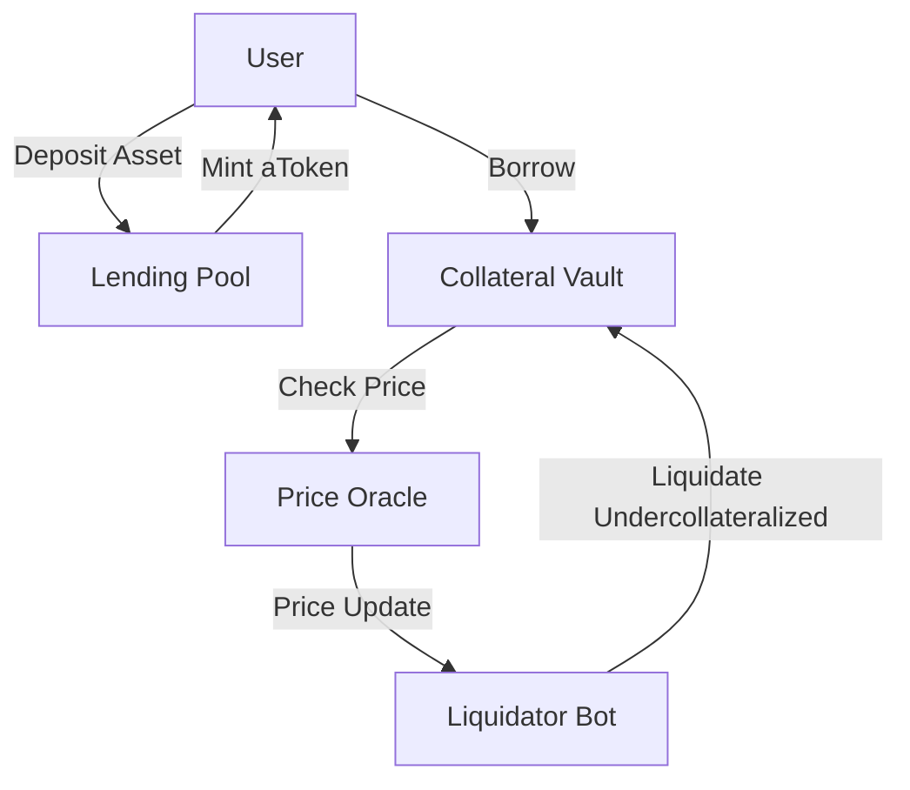

# DeFi Protocols

## AMM Math (Constant Product)
The fundamental formula for DEXes like Uniswap V2 is $x \times y = k$.

```solidity
contract SimpleAMM {
    uint public reserve0;
    uint public reserve1;

    function swap(uint amountIn, bool isToken0) external returns (uint amountOut) {
        require(amountIn > 0, "Invalid amount");
        (uint reserveIn, uint reserveOut) = isToken0 ? (reserve0, reserve1) : (reserve1, reserve0);
        
        // amountOut = (amountIn * 997 * reserveOut) / (reserveIn * 1000 + amountIn * 997)
        uint amountInWithFee = amountIn * 997;
        amountOut = (amountInWithFee * reserveOut) / (reserveIn * 1000 + amountInWithFee);
        
        // Update reserves...
    }
}
```

## Lending Pool Architecture
Overcollateralized lending requires robust liquidation mechanisms when Health Factor < 1.

## Protocol Interactions

