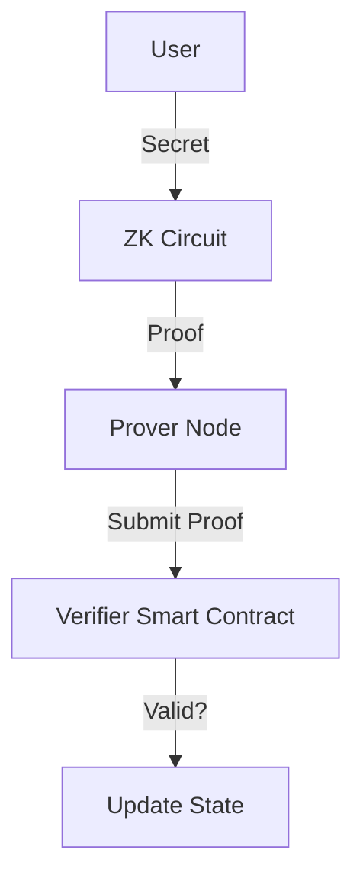

# Zero-Knowledge Proofs

## ZK Circuits (Circom)
Create arithmetic circuits to prove knowledge of a pre-image without revealing it.

```circom
pragma circom 2.0.0;
include "node_modules/circomlib/circuits/poseidon.circom";

template SecretHasher() {
    signal input secret;
    signal output hash;

    component poseidon = Poseidon(1);
    poseidon.inputs[0] <== secret;
    hash <== poseidon.out;
}

component main = SecretHasher();
```

## zk-SNARKs
Use Groth16 or Plonk for succinct non-interactive arguments of knowledge. Ensure trusted setup (PTAU) for Groth16.

## Privacy Protocol Architecture

