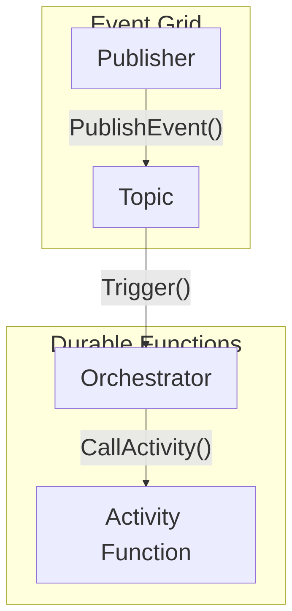

# Azure Functions: Durable Execution and Event Grid

Durable Functions extend Azure Functions by enabling stateful workflows in a serverless environment. It uses the Event Sourcing pattern, where the framework stores the complete history of function executions in an Azure Storage Table. When a workflow is suspended (e.g., waiting for an external event), the orchestrator function stops execution. Once the event occurs, the orchestrator replays from the beginning, using the event history to skip already completed steps.

Azure Event Grid provides an event-routing backplane. It uses a push-based model with built-in retry mechanisms, ensuring reliable delivery. 

