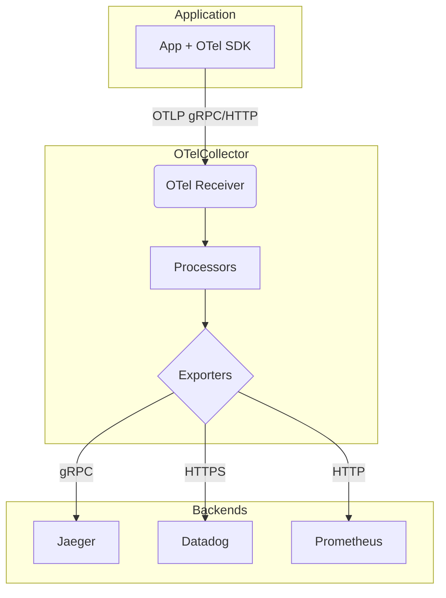

# Deep Dive: OpenTelemetry (OTel) Architecture

## Architecture Overview
OpenTelemetry normalizes telemetry data (Metrics, Logs, Traces) across multiple languages and platforms. The core component for infrastructure is the **OTel Collector**.



## Pipeline Stages
1. **Receivers**: How data gets in. Can be push or pull based.
2. **Processors**: Data manipulation (batching, filtering, PII masking). The `batch` processor is mandatory for high-throughput environments to prevent network exhaustion.
3. **Exporters**: How data gets sent to observability backends.

### Example configuration (otel-collector-config.yaml)
```yaml
receivers:
  otlp:
    protocols:
      grpc: { endpoint: 0.0.0.0:4317 }
      http: { endpoint: 0.0.0.0:4318 }

processors:
  batch:
    send_batch_size: 1000
    timeout: 1s
  memory_limiter:
    check_interval: 1s
    limit_mib: 1024

exporters:
  prometheus:
    endpoint: "0.0.0.0:8889"
  jaeger:
    endpoint: "jaeger-all-in-one:14250"
    tls:
      insecure: true

service:
  pipelines:
    traces:
      receivers: [otlp]
      processors: [memory_limiter, batch]
      exporters: [jaeger]
```
