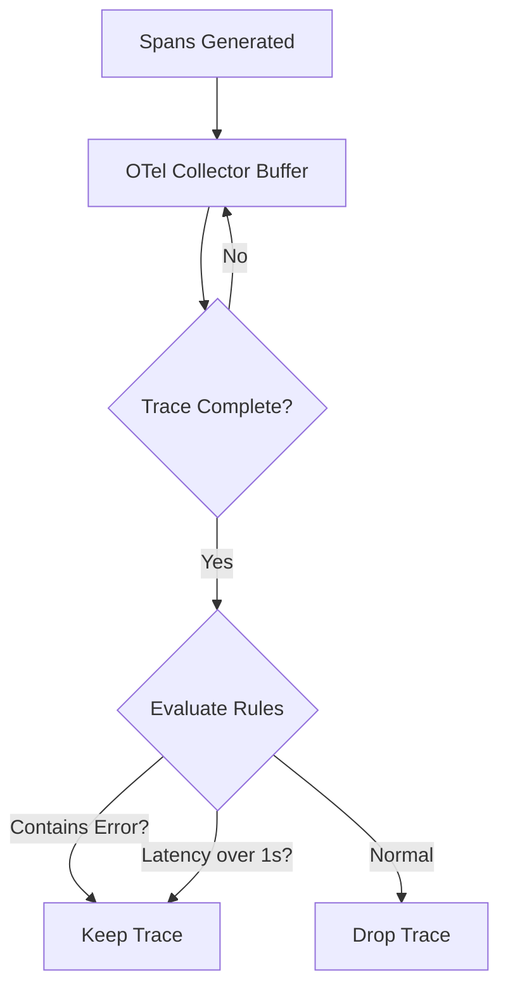

# Advanced Sampling Strategies

In high-volume systems (e.g., millions of requests per second), storing 100% of trace spans is cost-prohibitive and degrades performance. 

## Head-Based Sampling
The sampling decision is made at the root span (the very beginning of the trace).
- **Pros**: Low overhead. If a trace is dropped, downstream services don't even bother generating spans.
- **Cons**: You cannot sample based on outcome. If a request takes 30 seconds or throws a HTTP 500 *deep* in the stack, but the root span decided *not* to sample it, that trace is lost forever.

## Tail-Based Sampling
The sampling decision is made *after* the trace completes.



### OTel Tail-Sampling Configuration
Tail-based sampling requires the OTel collector to buffer spans in memory.
```yaml
processors:
  tail_sampling:
    decision_wait: 10s # Wait for late spans
    num_traces: 100000
    policies:
      [
        {
          name: errors-policy,
          type: status_code,
          status_code: {status_codes: [ERROR]}
        },
        {
          name: randomized-policy,
          type: probabilistic,
          probabilistic: {sampling_percentage: 5}
        }
      ]
```
