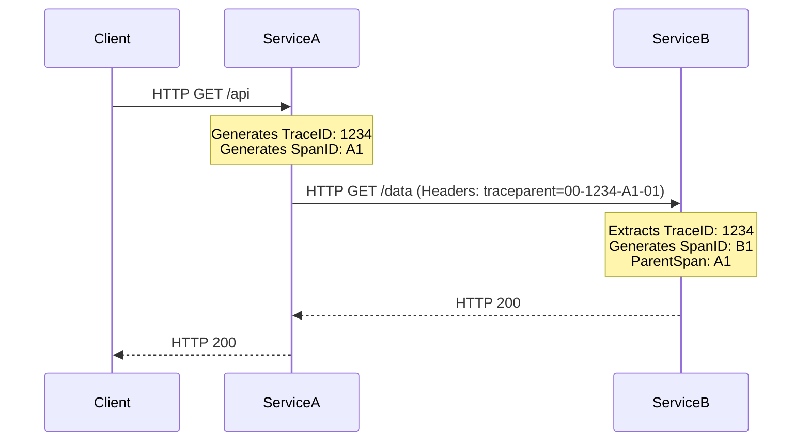

# W3C Trace Context Propagation

## Mechanics of Propagation
Distributed tracing relies on propagating Context (Trace ID and Span ID) across service boundaries. The W3C specification dictates two HTTP headers:
1. `traceparent`: Encodes the trace ID, parent span ID, and sampling flags.
2. `tracestate`: Vendor-specific routing or metadata.



## Anatomy of traceparent
Format: `version-traceid-parentid-traceflags`
- `version`: `00` (currently the only valid version)
- `traceid`: 16-byte array (32 hex characters) globally unique.
- `parentid`: 8-byte array (16 hex characters) of the caller's span.
- `traceflags`: `01` means sampled, `00` means not sampled.

### Example Injection (Python/Requests)
```python
import requests
from opentelemetry.propagate import inject

headers = {}
# The inject method reads the current ambient Trace Context and populates the headers dict
inject(headers) 
# headers now contains {'traceparent': '00-0af76...-01'}

response = requests.get("http://service-b/api/data", headers=headers)
```
