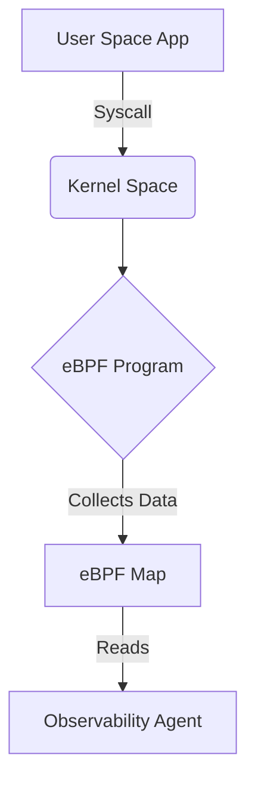

# eBPF Observability

Focus on creating kernel-level monitoring and tracing applications using eBPF.

## eBPF Snippet (C)
```c
#include <uapi/linux/ptrace.h>
#include <linux/sched.h>

BPF_HASH(start, u32);

int do_sys_execve(struct pt_regs *ctx) {
    u32 pid = bpf_get_current_pid_tgid();
    u64 ts = bpf_ktime_get_ns();
    start.update(&pid, &ts);
    return 0;
}
```

## Loader Snippet (Python)
```python
from bcc import BPF

b = BPF(text="""...""")
b.attach_kprobe(event=b.get_syscall_fnname("execve"), fn_name="do_sys_execve")
print("Tracing execve... Ctrl-C to end.")
try:
    b.trace_print()
except KeyboardInterrupt:
    exit()
```

## Trace Diagram

