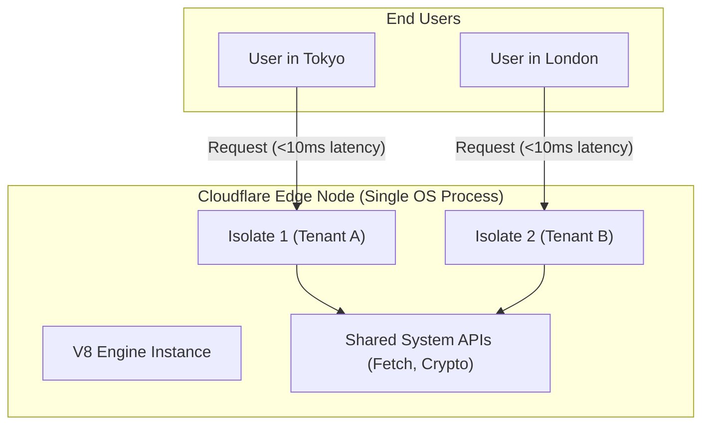

# Edge Computing & V8 Isolates

## Core Architecture

Edge computing moves backend logic as close to the user as possible (to CDN edge nodes). Cloudflare Workers achieve this without the "Cold Start" penalty of traditional Serverless functions like AWS Lambda.

### 1. V8 Isolates vs Containers
- **Containers (Docker/Lambda):** Every function boots a lightweight microVM or container, loads the OS kernel, loads Node.js, and runs the code. This takes 200ms - 1000ms (Cold Start).
- **V8 Isolates (Cloudflare Workers):** Runs directly on Google's V8 JavaScript engine. An "Isolate" is just an isolated memory heap and context. Booting a new isolate takes **<5ms**. Thousands of isolates can run within a single OS process, drastically reducing overhead.

### Architecture Map

