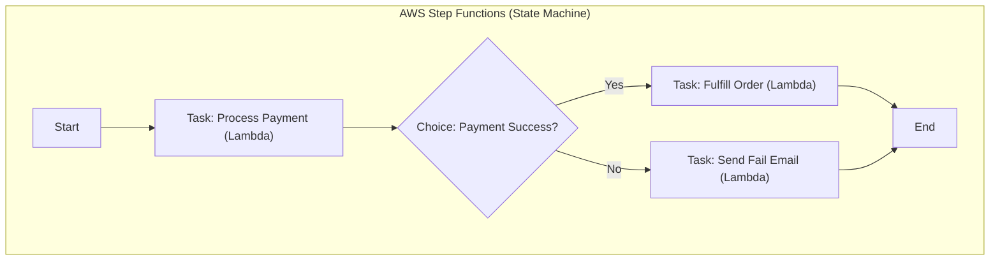

# Serverless Orchestration (Step Functions)

## Core Architecture

When building complex serverless applications, orchestrating multiple AWS Lambda functions becomes a challenge. AWS Step Functions solve this by maintaining state across functions using State Machines.

### 1. State Machines (JSON ASL)
Defined using the Amazon States Language (ASL). You can define logical flows: `Task`, `Choice` (If/Else), `Parallel`, `Map` (For-loop), and `Wait`.
- **Stateless Lambdas:** Lambdas should do one thing and forget. Step Functions hold the state and pass the output of one Lambda as the input to the next.

### 2. Error Handling & Retries
Step Functions natively support try/catch blocks, exponential backoff retries, and dead-letter queue routing without writing any code inside the Lambda.

### Orchestration Map

