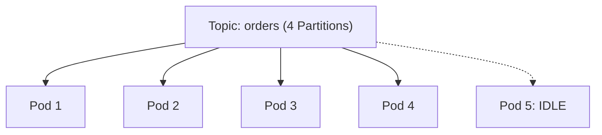

# Kafka Scaler Mechanics

Scaling Kafka consumers in Kubernetes requires understanding consumer group mechanics.

## Kafka Partition Limits
Unlike HTTP scaling where 1000 requests can be served by 1000 pods, Kafka scales by partitions. If a topic has 10 partitions, a consumer group can have *at most* 10 active consumers. If KEDA scales the deployment to 15, 5 pods will sit idle doing nothing, wasting cluster resources.



## Consumer Lag Calculation
KEDA's Kafka trigger connects to the broker and fetches two values:
1. `Log-End-Offset (LEO)`: The latest message published to the topic.
2. `Current-Offset`: The last message committed by the consumer group.
`Lag = LEO - Current-Offset`

If `Lag > lagThreshold`, KEDA instructs the HPA to scale out.

```yaml
triggers:
- type: kafka
  metadata:
    bootstrapServers: kafka.namespace.svc.cluster.local:9092
    consumerGroup: my-group
    topic: my-topic
    lagThreshold: '50'
    offsetResetPolicy: latest
    allowRouting: "true"
```
