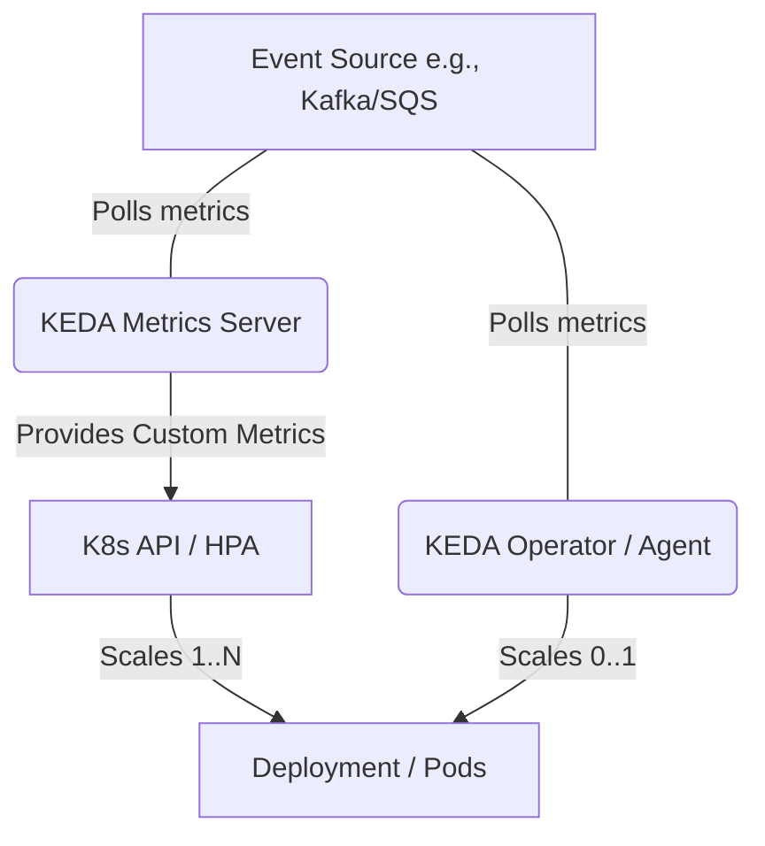

# KEDA Deep Architecture

Kubernetes Event-driven Autoscaling (KEDA) acts as an intelligent intermediary between event sources and the Kubernetes Horizontal Pod Autoscaler (HPA).

## Internal Components


### The Scale-to-Zero Problem
Standard HPA evaluates metrics like CPU and Memory. If a Deployment has 0 replicas, it uses 0 CPU, meaning the HPA cannot calculate the metric required to scale it up to 1. KEDA solves this by deploying its own operator that watches the event source directly. When the event count > 0, KEDA forcefully scales the Deployment to 1. Once at 1 replica, the HPA takes over.

### Custom Resource: ScaledObject
```yaml
apiVersion: keda.sh/v1alpha1
kind: ScaledObject
metadata:
  name: order-processor-scaler
spec:
  scaleTargetRef:
    name: order-processor-deployment
  minReplicaCount: 0
  maxReplicaCount: 100
  triggers:
  - type: prometheus
    metadata:
      serverAddress: http://prometheus-operated.monitoring.svc.cluster.local:9090
      metricName: http_requests_total
      threshold: '100'
      query: sum(rate(http_requests_total{app="order-processor"}[2m]))
```
