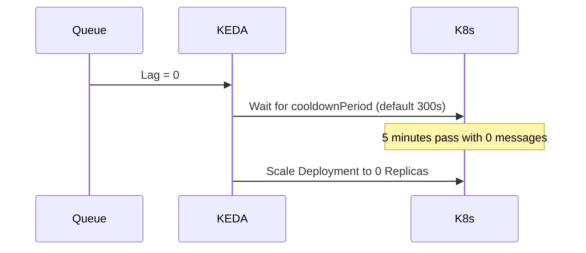

# Scale-to-Zero and Hysteresis

## Flapping and Cooldown
When a queue hits 1 message, KEDA scales the deployment to 1. The pod processes the message in 100ms. The queue is now 0. Does KEDA immediately scale back to 0? 

If it did, and 2 seconds later another message arrived, Kubernetes would have to schedule a new pod, pull the image, and suffer a cold start. This rapid up-and-down is called **Flapping**.



## Configuration Tuning
- `pollingInterval`: How often KEDA checks the event source (default 30s). Lower values decrease cold start latency but increase API load on the event source (e.g., AWS SQS API costs).
- `cooldownPeriod`: How long to wait after the last event before scaling back to zero (default 300s).

```yaml
spec:
  pollingInterval:  15
  cooldownPeriod:   300
  idleReplicaCount: 0
```
