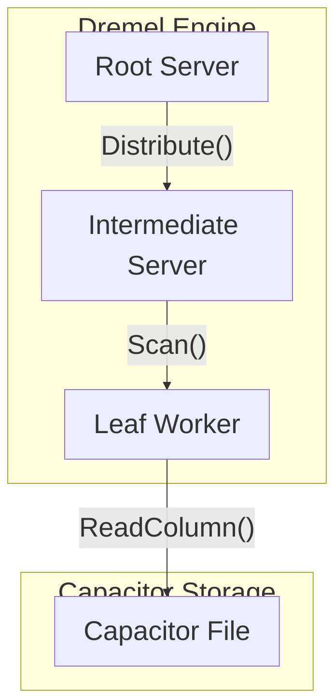

# GCP BigQuery: Dremel and Capacitor

BigQuery separates compute and storage. The execution engine, Dremel, uses a multi-level execution tree. A root server receives the query, rewrites it, and distributes it to intermediate servers, which then distribute it to leaf nodes (workers) that scan the data.

Data is stored in Colossus using the Capacitor columnar format. Capacitor optimizes data access by utilizing advanced encoding (e.g., dictionary encoding, run-length encoding) and maintaining statistical metadata. This metadata allows Dremel workers to prune unnecessary blocks without reading them.

