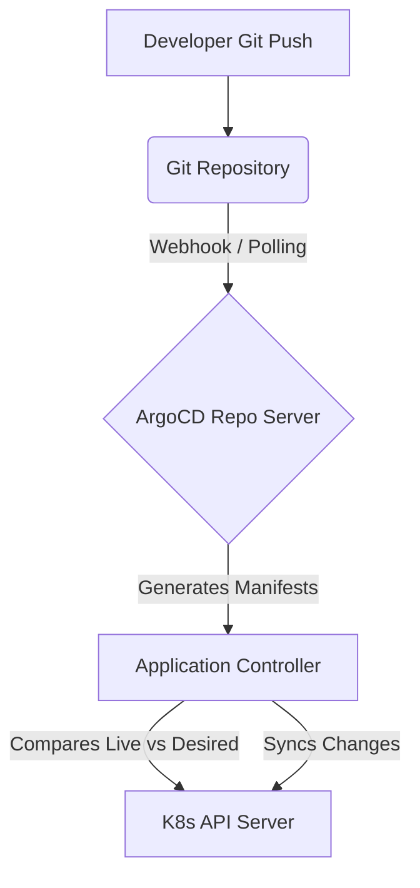

# ArgoCD Architecture & Reconciliation Loop

ArgoCD implements a declarative GitOps continuous delivery pattern. The state of the cluster is entirely driven by Git.

## Component Deep Dive
- **Repo Server**: Maintains a local cache of the Git repository holding the application manifests. It understands Helm, Kustomize, and raw YAML. It runs `helm template` or `kustomize build` to render the final desired state.
- **Application Controller**: A Kubernetes controller that continuously compares the live state in the cluster against the target state generated by the repo server. If they differ, the application is marked as `OutOfSync`.
- **Redis Cache**: ArgoCD uses Redis heavily to cache the rendered manifests and cluster states to reduce load on the K8s API server.

## Drift Detection
When a cluster admin manually edits a Deployment using `kubectl edit` (creating Drift), ArgoCD immediately detects the mismatch between the live K8s API and Git. If `selfHeal: true` is enabled, ArgoCD will instantly revert the manual changes, enforcing Git as the absolute source of truth.
