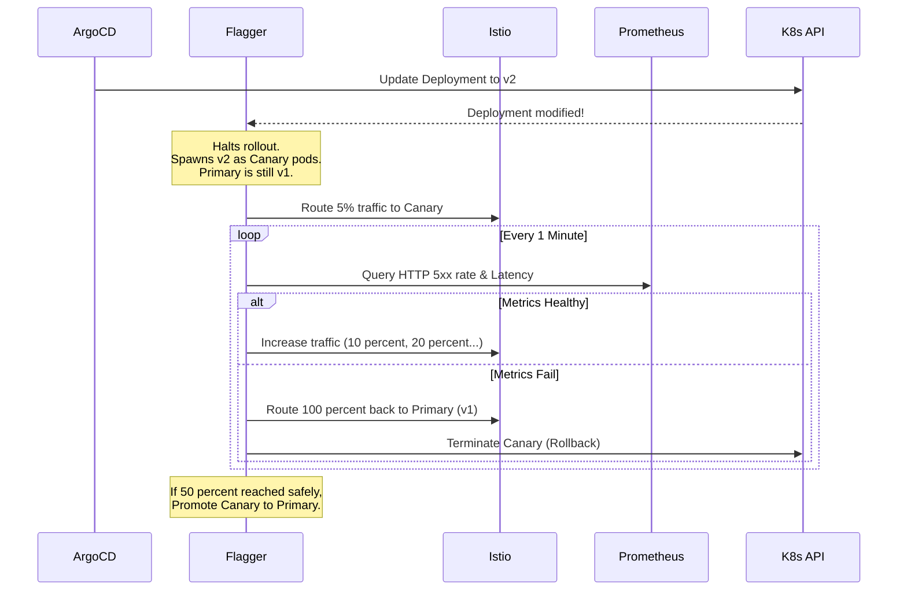

# Progressive Delivery with Flagger

Progressive delivery eliminates the massive risk of "Big Bang" deployments by routing a small percentage of traffic to a new version, monitoring its health, and automatically rolling back if errors occur.

## Flagger Workflow



## The Canary CRD
Flagger abstracts away the complex Istio/Nginx routing configurations via the `Canary` resource:
```yaml
apiVersion: flagger.app/v1beta1
kind: Canary
metadata:
  name: frontend
spec:
  targetRef:
    apiVersion: apps/v1
    kind: Deployment
    name: frontend
  service:
    port: 80
  analysis:
    interval: 1m
    threshold: 5 # Rollback if 5 checks fail
    maxWeight: 50
    stepWeight: 10
    metrics:
    - name: request-success-rate
      thresholdRange:
        min: 99
      interval: 1m
    - name: request-duration
      thresholdRange:
        max: 500
      interval: 1m
```
