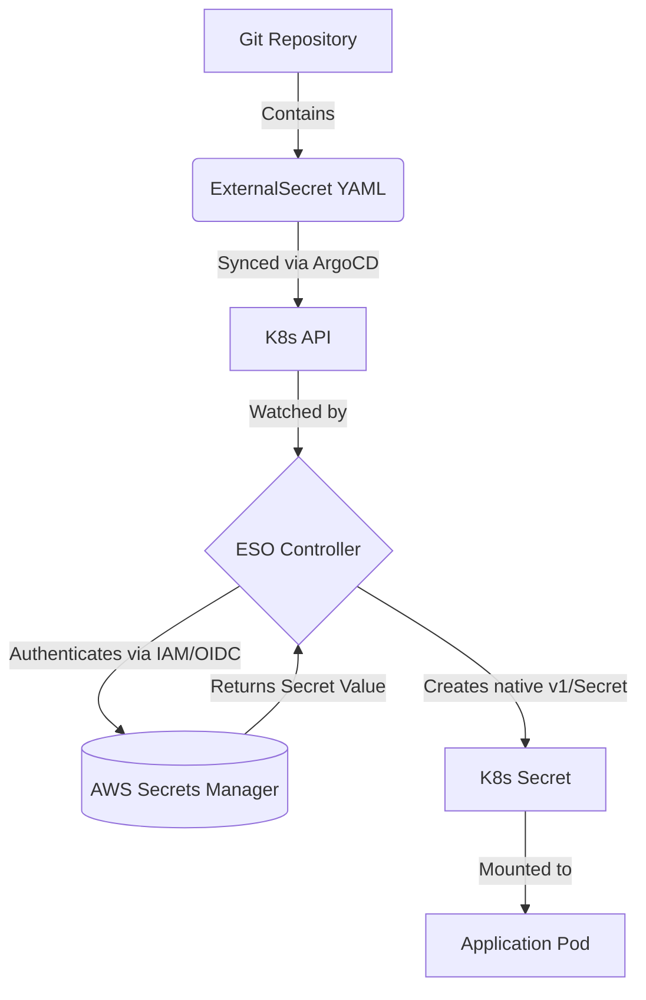

# External Secrets Operator (ESO)

The cardinal rule of GitOps: **Never commit raw secrets to Git.**

ESO solves this by moving secret management to specialized Vaults (AWS Secrets Manager, Azure Key Vault, HashiCorp Vault) while keeping the Kubernetes workflow fully declarative.



## The CRDs
1. **SecretStore / ClusterSecretStore**: Defines *how* to authenticate to the external provider.
```yaml
apiVersion: external-secrets.io/v1beta1
kind: SecretStore
metadata:
  name: aws-secretsmanager
spec:
  provider:
    aws:
      service: SecretsManager
      region: us-east-1
      auth:
        jwt:
          serviceAccountRef:
            name: eso-sa # Uses IAM Roles for Service Accounts (IRSA)
```

2. **ExternalSecret**: Defines *what* secret to fetch and where to put it.
```yaml
apiVersion: external-secrets.io/v1beta1
kind: ExternalSecret
metadata:
  name: db-credentials
spec:
  refreshInterval: "1h"
  secretStoreRef:
    name: aws-secretsmanager
    kind: SecretStore
  target:
    name: app-db-secret # The native k8s secret to be created
  data:
  - secretKey: password
    remoteRef:
      key: prod/rds/password
```
