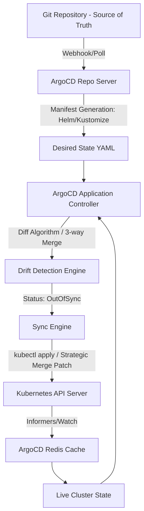

# ArgoCD GitOps Mechanics: Reconciliation and Drift

## The GitOps Paradigm
GitOps shifts operational configuration management to Git repositories as the single source of truth. ArgoCD implements this via a declarative, pull-based continuous delivery model for Kubernetes. The core mechanism is the continuous reconciliation of the desired state (defined in Git) with the live state (running in the Kubernetes cluster).

## The ArgoCD Application Controller & Reconciliation Loop
The `argocd-application-controller` is the heart of ArgoCD. It continuously monitors running applications and compares the live cluster state against the desired target state specified in the Git repository.
- **State Caching**: To prevent overwhelming the Kubernetes API server, ArgoCD maintains a highly optimized, memory-based cache of the cluster state (using informers).
- **Reconciliation Cycle**: By default, the reconciliation loop triggers every 3 minutes or upon webhook notifications from the Git provider. The controller evaluates the manifest generation (via Helm, Kustomize, or raw YAML) and computes the diff against the cached live state.

## Drift Detection Algorithms
Drift detection relies on three-way strategic merge patching (similar to `kubectl apply`). 
1. **Desired State**: Generated YAML from Git.
2. **Live State**: The actual Kubernetes resource JSON.
3. **Last Applied Configuration**: The annotation tracking the previous state applied by ArgoCD.

ArgoCD computes the delta. If structural or value differences exist (excluding ignored fields like `status` or dynamically injected defaults by mutating admission webhooks), the application is marked as `OutOfSync`. The synchronization phase then executes the calculated patch (or create/delete operations) to eliminate the drift, adhering to configured sync waves and hooks.

## Architecture Map

