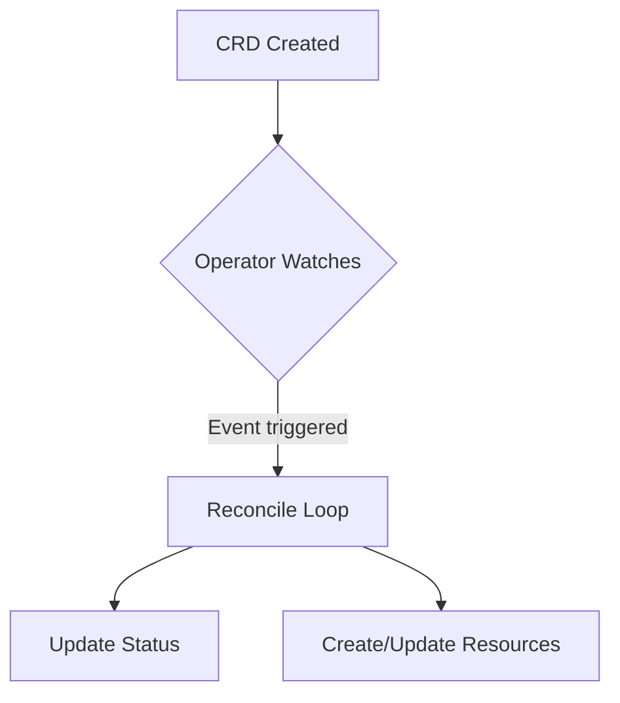

# Kubernetes Mastery

Focus on writing robust Kubernetes Operators and advanced Helm Charts.

## K8s Operator Snippet (Go)
```go
import (
    "context"
    "github.com/go-logr/logr"
    ctrl "sigs.k8s.io/controller-runtime"
    "sigs.k8s.io/controller-runtime/pkg/client"
)

type MyReconciler struct {
    client.Client
    Log logr.Logger
}

func (r *MyReconciler) Reconcile(ctx context.Context, req ctrl.Request) (ctrl.Result, error) {
    _ = r.Log.WithValues("myresource", req.NamespacedName)
    // Reconcile logic here
    return ctrl.Result{}, nil
}
```

## Advanced Helm Chart (YAML)
```yaml
{{- if .Values.ingress.enabled -}}
apiVersion: networking.k8s.io/v1
kind: Ingress
metadata:
  name: {{ include "mychart.fullname" . }}
  annotations:
    {{- toYaml .Values.ingress.annotations | nindent 4 }}
spec:
  rules:
    {{- range .Values.ingress.hosts }}
    - host: {{ .host | quote }}
      http:
        paths:
          {{- range .paths }}
          - path: {{ .path }}
            pathType: {{ .pathType }}
            backend:
              service:
                name: {{ include "mychart.fullname" $ }}
                port:
                  number: {{ $.Values.service.port }}
          {{- end }}
    {{- end }}
{{- end }}
```

## Architecture Diagram

