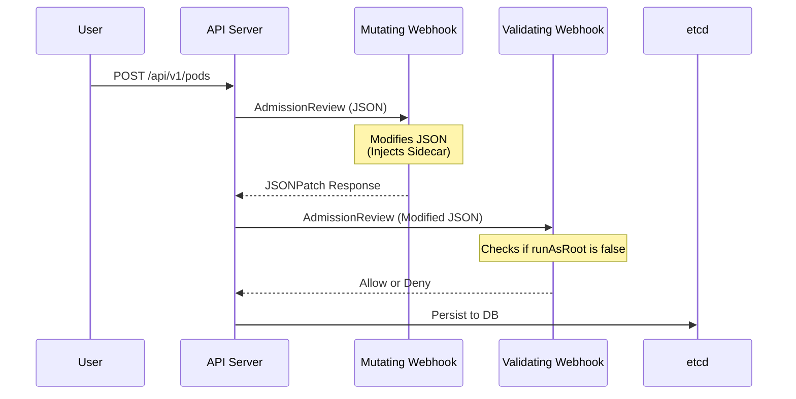

# Dynamic Admission Control (Webhooks)

Admission webhooks intercept requests to the API server before they are persisted to etcd. 



## Mutating Webhooks (JSONPatch)
When the Mutating Webhook intercepts an object, it must return an `AdmissionResponse` containing a base64 encoded JSONPatch (RFC 6902) array.
```json
[
  {
    "op": "add",
    "path": "/spec/containers/1",
    "value": {
      "name": "envoy-sidecar",
      "image": "envoyproxy/envoy:v1.20",
      "ports": [{"containerPort": 15000}]
    }
  }
]
```

## Operational Challenges
- **TLS Requirement**: The API server requires webhooks to be served over HTTPS. Managing the CA bundles for webhooks is complex (often solved via `cert-manager`).
- **Timeouts**: If a webhook is slow or down, the API server will block deployments. `failurePolicy` can be set to `Fail` (strict security) or `Ignore` (high availability).
