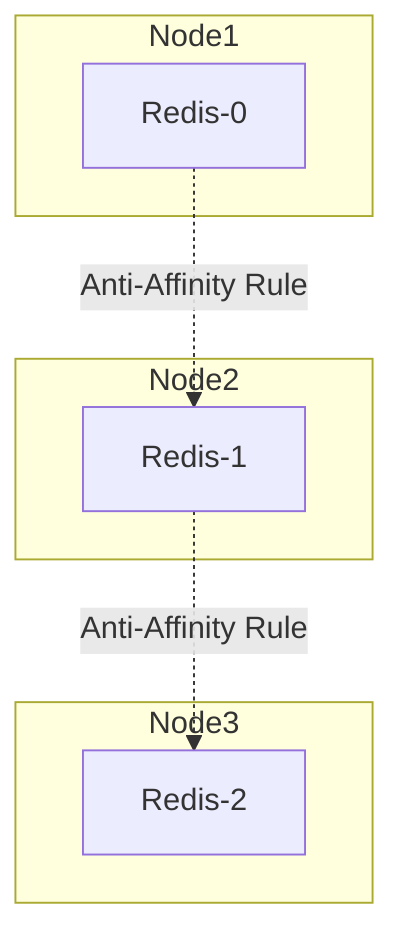

# Advanced Scheduling: Affinity & Taints

Ensuring high availability requires intelligent scheduling of Pods across Nodes.

## Taints and Tolerations (Node repulsion)
Taints are applied to Nodes. Pods without the matching Toleration cannot be scheduled on that Node.
- **Node Taint**: `kubectl taint nodes node1 gpu=true:NoSchedule`
- **Pod Toleration**:
```yaml
tolerations:
- key: "gpu"
  operator: "Equal"
  value: "true"
  effect: "NoSchedule"
```

## Pod Anti-Affinity (Workload separation)
To ensure that a Redis cluster does not run all of its replicas on the exact same physical node (which would cause total outage if the node dies), we use Pod Anti-Affinity.



```yaml
affinity:
  podAntiAffinity:
    requiredDuringSchedulingIgnoredDuringExecution: # Hard requirement
    - labelSelector:
        matchExpressions:
        - key: app
          operator: In
          values:
          - redis
      topologyKey: "kubernetes.io/hostname" # Do not schedule on the same hostname
```
