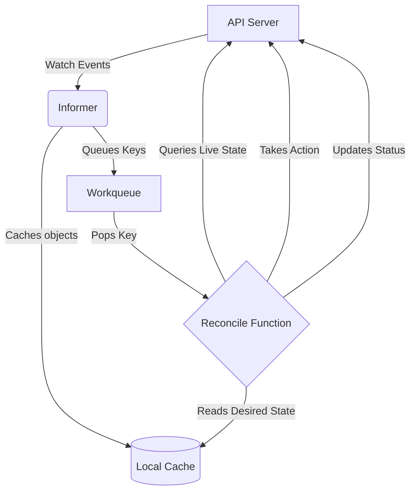

# Operator Pattern & Reconciliation Loops

Kubernetes Operators are custom controllers that encode operational knowledge (like how to back up a database, handle failovers, or upgrade schemas) directly into Kubernetes.

## The Reconciliation Loop (Level-Triggered)
Kubernetes controllers do not respond purely to events (edge-triggered). Instead, they are **level-triggered**. They constantly read the *Desired State* (from a Custom Resource) and the *Actual State* (the physical cluster state), and take actions to bridge the gap.



## Kubebuilder / Go implementation
A standard `Reconcile` loop in Go:
```go
func (r *MyReconciler) Reconcile(ctx context.Context, req ctrl.Request) (ctrl.Result, error) {
    // 1. Fetch the Custom Resource
    var myApp myv1.App
    if err := r.Get(ctx, req.NamespacedName, &myApp); err != nil {
        return ctrl.Result{}, client.IgnoreNotFound(err)
    }

    // 2. Check actual state (e.g., does a Deployment exist?)
    // 3. If missing, create it. If incorrect, update it.
    
    // 4. Update the Status of the Custom Resource
    myApp.Status.Ready = true
    r.Status().Update(ctx, &myApp)

    // Requeue after 5 minutes to ensure no drift occurred outside of events
    return ctrl.Result{RequeueAfter: time.Minute * 5}, nil
}
```
