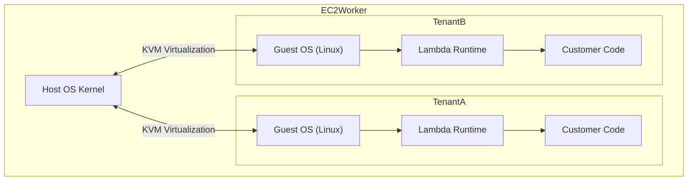

# Firecracker MicroVM & Serverless Execution

AWS Lambda does not run your code in a standard Docker container on a shared kernel. To achieve multi-tenant security, it runs your code inside a specialized lightweight virtual machine called **Firecracker**.

## The Virtualization Boundary

## Cold Start Timeline
1. **VM Provisioning**: Firecracker boots a tiny Linux guest OS (taking < 125ms).
2. **Runtime Boot**: The language runtime (e.g., Node.js V8 engine, Java JVM) initializes. This is heavily dependent on the runtime size.
3. **Init Code Execution**: Any code located *outside* your `exports.handler = async () => {}` function is executed.
4. **Invocation**: The actual handler runs.

**Optimization Note**: The resources (CPU/RAM) allocated during the Init phase (Step 3) are boosted beyond your configured Lambda memory limit by AWS to execute initialization as fast as possible.
