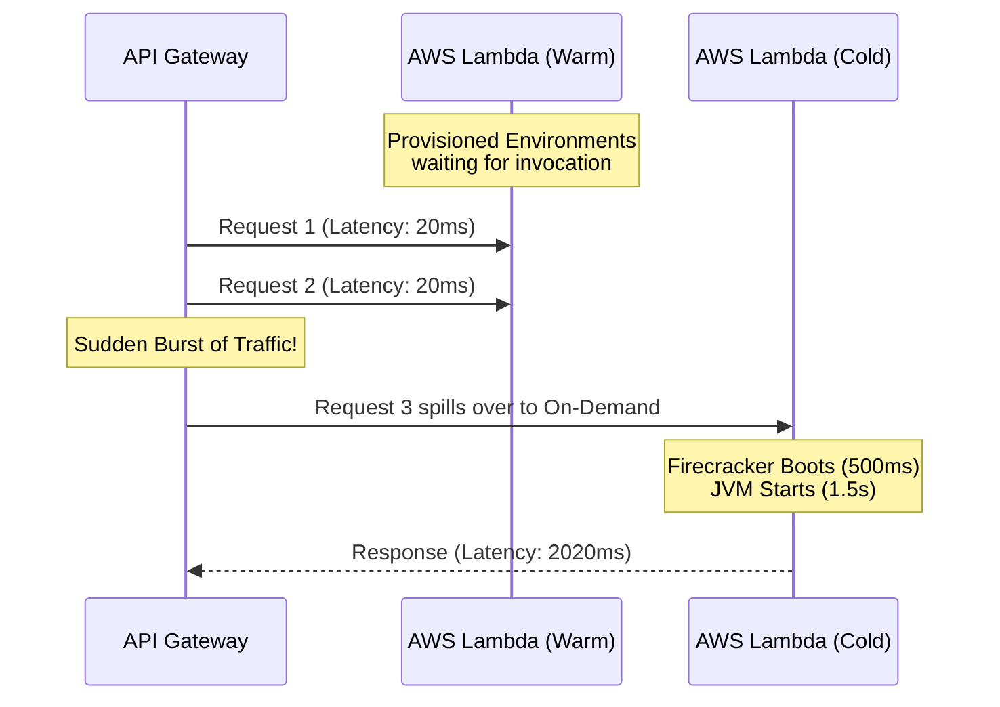

# Provisioned Concurrency

Cold starts are unacceptable for synchronous, user-facing APIs with strict P99 latency SLAs.

## Mechanics
Provisioned Concurrency instructs AWS to initialize a requested number of execution environments and keep them completely warm (Steps 1, 2, and 3 of the Cold Start timeline are completed in advance).



## Configuration & Economics
- **Cost**: You pay a continuous hourly rate for provisioned capacity, plus a smaller fee per invocation. It transitions Lambda from a purely variable cost to a semi-fixed cost.
- **Auto Scaling**: Application Auto Scaling can be configured to adjust the provisioned concurrency level based on schedule (e.g., scale up at 8 AM, scale down at 8 PM) or utilization metrics (`ProvisionedConcurrencyUtilization > 70%`).

```hcl
# Terraform Example
resource "aws_lambda_provisioned_concurrency_config" "example" {
  function_name                     = aws_lambda_function.example.function_name
  provisioned_concurrent_executions = 50
  qualifier                         = aws_lambda_function.example.version
}
```
