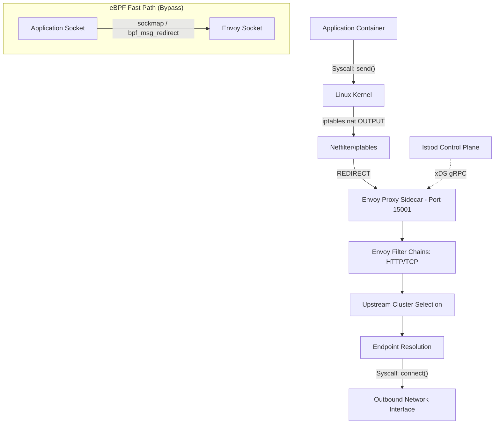

# Istio & Envoy: Deep Mechanics of Traffic Interception and Routing

## Core Architecture & Interception Paradigms
Istio's data plane relies intrinsically on the Envoy proxy, deployed as a sidecar. Historically, transparent traffic interception was achieved via Linux `iptables`, configuring `PREROUTING` and `OUTPUT` chains in the `nat` table to redirect inbound/outbound packets to Envoy's local listening ports (e.g., 15001, 15006) using the `REDIRECT` target.

### Envoy Proxy: Threading Model and State
Envoy operates on a single-process, multi-threaded architecture. A primary thread manages the xDS API lifecycle (ADS/Delta), coordinating cluster (CDS), route (RDS), listener (LDS), and endpoint (EDS) discovery services with the Istio control plane (Istiod). Worker threads utilize non-blocking I/O (epoll/kqueue) to process the actual data plane traffic.

### Evolving Interception: From iptables to eBPF
The overhead of traversing the Linux networking stack (TCP/IP stack, netfilter hooks) for local sidecar communication is significant. Advanced CNI implementations (like Merbridge or ambient mesh patterns) leverage eBPF (Extended Berkeley Packet Filter) to bypass the host networking stack entirely for pod-to-pod or pod-to-sidecar traffic. Using `bpf_redirect` at the socket layer (sockmap) allows TCP payloads to be copied directly between the application and Envoy sockets, reducing latency and CPU cycles dramatically.

## Architecture Map

