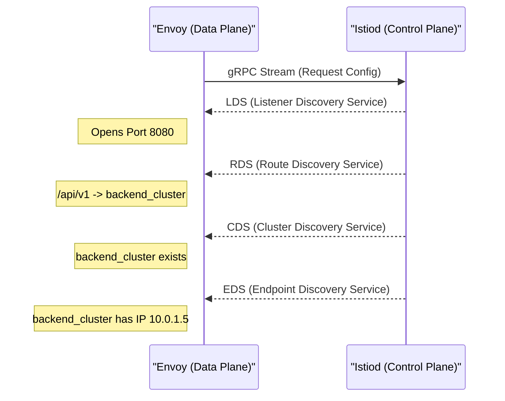

# Service Mesh: Envoy and the xDS Protocol

## 1. Data Plane vs Control Plane
A Service Mesh is divided into two distinct components:
- **Data Plane**: The actual network proxies (sidecars) that intercept and route all TCP/HTTP traffic between microservices.
- **Control Plane**: The central brain (e.g., Istiod) that computes the routing rules, policies, and certificates, and pushes them to the Data Plane.

## 2. Envoy Proxy
Envoy is the industry standard Data Plane for service meshes. Written in C++, it is designed for extreme performance and low memory footprint.

Unlike traditional proxies (like NGINX or HAProxy) which require generating a static configuration file (`nginx.conf`) and reloading the process (dropping active connections or causing latency spikes), Envoy was built from the ground up to have its configuration updated dynamically via APIs.

## 3. The xDS APIs
Envoy pulls its configuration dynamically from the Control Plane using a suite of gRPC streaming APIs known collectively as **xDS** (Discovery Services).

### Breakdown of xDS:
1. **LDS (Listener)**: Tells Envoy which ports to listen on (e.g., "Listen on TCP 8080").
2. **RDS (Route)**: Provides HTTP routing rules (e.g., "If path starts with `/api/v1`, route to `backend_cluster`").
3. **CDS (Cluster)**: Defines backend upstream clusters (e.g., configuring circuit breaking, timeouts, or TLS requirements for `backend_cluster`).
4. **EDS (Endpoint)**: Provides the actual IP addresses of the pods in the cluster (e.g., `10.0.1.5`, `10.0.1.6`).

Because this is a persistent bidirectional gRPC stream, when a Kubernetes Pod scales up, the Control Plane instantly pushes a new EDS update to all Envoy proxies, making routing instantaneous without a single process reload.
