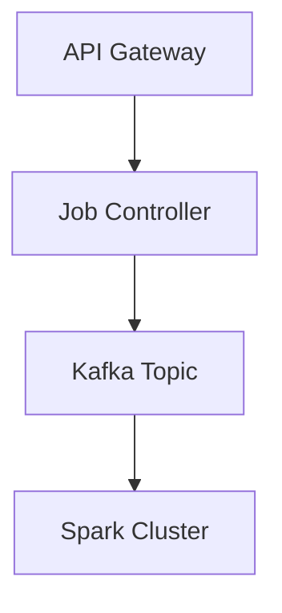

# Api Reference

## Deep Architectural Analysis
The RESTful API for batch processing acts as the primary ingress controller. It utilizes an asynchronous event-driven architecture with an underlying message queue (e.g., Apache Kafka) to decouple request ingestion from job execution, ensuring high availability and resilience under bursty workloads.

## Code Implementation
```python
from fastapi import FastAPI, BackgroundTasks
app = FastAPI()

@app.post("/jobs/submit")
async def submit_job(job_id: str, background_tasks: BackgroundTasks):
    background_tasks.add_task(process_spark_job, job_id)
    return {"status": "accepted"}
```

## System Architecture


## Mathematical Formulas Explaining Thresholds
Rate Limiting Token Bucket calculation:
$$ R_{allow} = \min(B, T_{current} + R_{fill} \times \Delta t) $$
Where $B$ is bucket capacity and $R_{fill}$ is refill rate.
