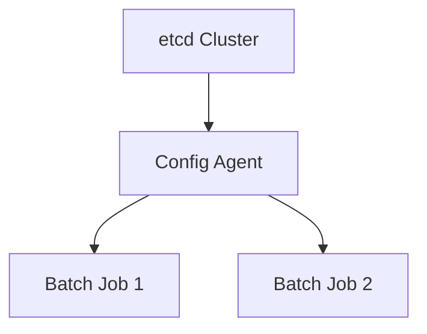

# Configuration Guide

## Deep Architectural Analysis
Configuration management in large-scale distributed systems relies on dynamic service discovery and consensus (e.g., ZooKeeper or etcd). The hierarchy of configurations allows for localized overrides, utilizing a cascading priority resolution system to ensure that runtime environments scale efficiently.

## Code Implementation
```sql
-- Dynamic configuration injection in Snowflake
ALTER SESSION SET STATEMENT_TIMEOUT_IN_SECONDS = 3600;
ALTER WAREHOUSE batch_wh SET WAREHOUSE_SIZE = 'X-LARGE';
```

## System Architecture


## Mathematical Formulas Explaining Thresholds
Configuration refresh interval optimization:
$$ I_{opt} = \sqrt{\frac{2 \cdot C_{update}}{\lambda_{change} \cdot C_{drift}}} $$
Where $C$ represents cost of update vs drift penalties.
