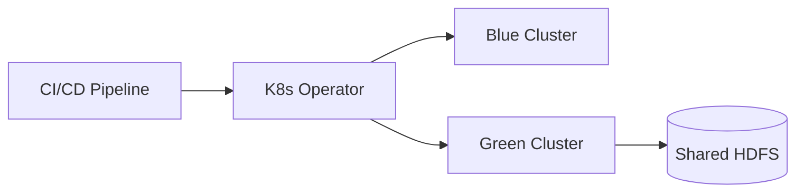

# Deployment Strategies

## Deep Architectural Analysis
We implement Blue-Green and Canary deployment models using Kubernetes operators for Apache Flink and Spark. This enables zero-downtime updates of stateful batch processes by snapshotting the Distributed File System (DFS) state and resuming the execution graph seamlessly across cluster transitions.

## Code Implementation
```yaml
apiVersion: sparkoperator.k8s.io/v1beta2
kind: SparkApplication
metadata:
  name: batch-job-v2
spec:
  type: Scala
  mode: cluster
  image: "spark:v3.1.2-canary"
```

## System Architecture


## Mathematical Formulas Explaining Thresholds
Canary traffic allocation over time:
$$ W(t) = \frac{1}{1 + e^{-k(t - t_0)}} $$
Sigmoid scaling function for safe rollouts.
