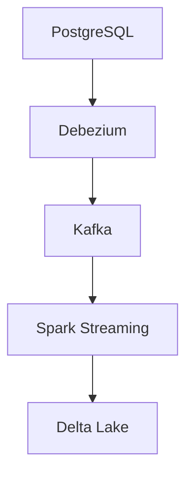

# Integration Guide

## Deep Architectural Analysis
Integrating heterogenous data sinks requires robust CDC (Change Data Capture) pipelines. We utilize Debezium paired with Kafka Connect to serialize transaction logs from relational databases into immutable batch logs, applying schema evolution via Avro/Protobuf registries.

## Code Implementation
```python
from confluent_kafka import Consumer
c = Consumer({'bootstrap.servers': 'kafka:9092', 'group.id': 'batch_integrator'})
c.subscribe(['cdc_postgres_events'])

while True:
    msg = c.poll(1.0)
    if msg is not None:
        write_to_data_lake(msg.value())
```

## System Architecture


## Mathematical Formulas Explaining Thresholds
Backpressure scaling limit:
$$ B_{max} = \frac{Q_{depth}}{R_{ingest} - R_{process}} $$
Calculates time-to-saturation for message queues.
