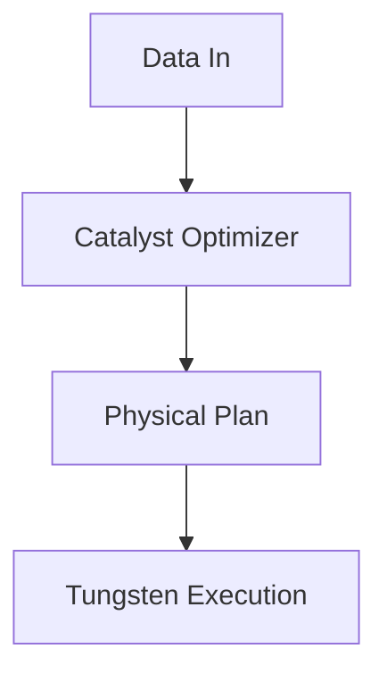

# Performance Tuning

## Deep Architectural Analysis
Performance tuning for Spark batch operations revolves around Catalyst optimizer rules, JVM garbage collection minimization, and RockDB checkpointing efficiency. Optimizing ORC/Parquet vectorization reads drastically reduces I/O wait times and CPU deserialization overhead.

## Code Implementation
```python
spark.conf.set("spark.sql.cbo.enabled", "true")
spark.conf.set("spark.sql.adaptive.enabled", "true")
spark.conf.set("spark.memory.fraction", "0.8")
```

## System Architecture


## Mathematical Formulas Explaining Thresholds
Shuffle partition determination:
$$ P = \lceil \frac{S_{total}}{T_{target}} \rceil \times \gamma $$
Where $S_{total}$ is shuffle data size and $T_{target}$ is 200MB optimal chunk size.
