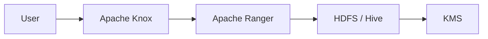

# Security Best Practices

## Deep Architectural Analysis
Batch data security mandates end-to-end encryption and granular Role-Based Access Control (RBAC). The architecture incorporates AWS KMS for envelope encryption of HDFS files and Apache Ranger for column-level security and dynamic data masking in transit.

## Code Implementation
```java
// Hadoop KMS Integration
Configuration conf = new Configuration();
conf.set("hadoop.security.key.provider.path", "kms://http@kms-server:9600/kms");
FileSystem fs = FileSystem.get(conf);
```

## System Architecture


## Mathematical Formulas Explaining Thresholds
Encryption Overhead Factor:
$$ E_{cost} = 1 + \left( \frac{S_{block}}{B_{enc}} \times C_{cipher} \right) $$
Quantifies CPU latency introduced by AES-256-GCM.
