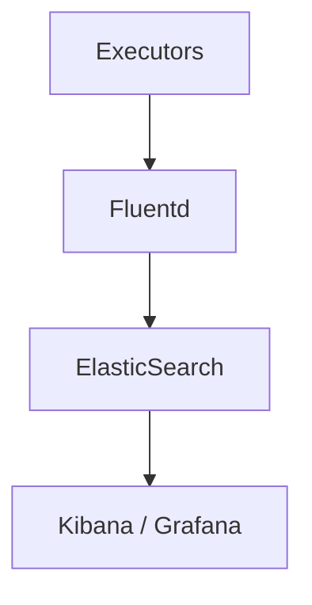

# Troubleshooting Guide

## Deep Architectural Analysis
Diagnosing distributed batch anomalies involves distributed tracing (e.g., Jaeger) and log aggregation (ELK stack). The core complexities usually stem from straggler tasks, data skew in shuffle phases, or OOM errors in the JVM heap space allocated to executors.

## Code Implementation
```python
# Identifying Data Skew
df.groupBy("join_key").count().orderBy("count", ascending=False).show(10)
# Salting technique to mitigate skew
from pyspark.sql.functions import rand
df_salted = df.withColumn("salt", (rand() * 10).cast("int"))
```

## System Architecture


## Mathematical Formulas Explaining Thresholds
Straggler detection threshold:
$$ T_{straggler} = \mu_{task} + (3 \times \sigma_{task}) $$
Any task exceeding this duration is preemptively killed and restarted.
