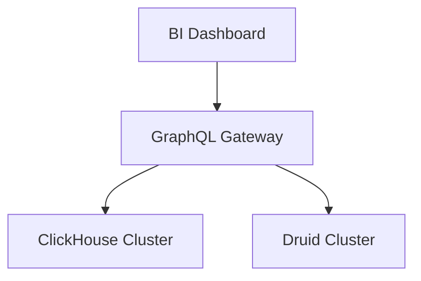

# BI Tools API Reference

## Deep Architectural Analysis
BI API layers typically utilize GraphQL federated gateways to coalesce queries from dashboards into targeted analytical workloads. This limits over-fetching and provides a unified semantic model over heterogeneous OLAP engines (e.g., ClickHouse, Druid).

## Code Implementation
```javascript
const { ApolloServer, gql } = require('apollo-server');
const typeDefs = gql`
  type SalesAgg { region: String, total: Float }
  type Query { getSales(region: String): [SalesAgg] }
`;
const resolvers = {
  Query: { getSales: (_, args) => queryClickHouse(args.region) }
};
const server = new ApolloServer({ typeDefs, resolvers });
```

## System Architecture


## Mathematical Formulas Explaining Thresholds
Query Pagination Limit:
$$ L = \frac{M_{ui}}{S_{row} \times F_{render}} $$
Where $M_{ui}$ is available client memory, and $F_{render}$ is the DOM rendering cost factor.
