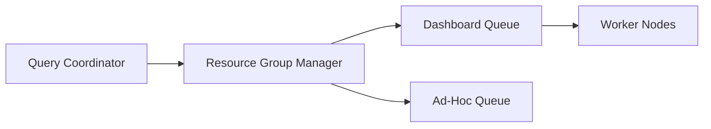

# BI Configuration Guide

## Deep Architectural Analysis
Configuration of BI tools centers on concurrency limits and memory pools for analytical queries. Query queueing mechanisms (like Presto/Trino resource groups) must be strictly configured to prevent heavy dashboard loads from starving ad-hoc data exploration.

## Code Implementation
```json
{
  "resource_groups": [
    {
      "name": "dashboard_queries",
      "softMemoryLimit": "70%",
      "hardConcurrencyLimit": 100,
      "maxQueued": 200
    }
  ]
}
```

## System Architecture


## Mathematical Formulas Explaining Thresholds
Concurrency Limit:
$$ C_{max} = \frac{Mem_{total} \times U_{target}}{Mem_{avg\_query}} $$
Ensures safe memory utilization without out-of-memory crashes.
