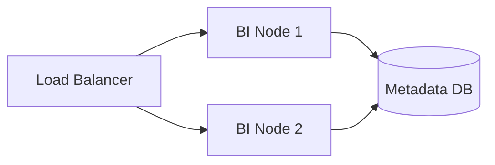

# BI Deployment Strategies

## Deep Architectural Analysis
Deploying BI tools (like Superset, Metabase) in a cloud-native environment involves stateless application nodes supported by a stateful metadata DB. High availability is achieved by autoscaling web pods behind an Ingress controller based on active WebSocket connections for live dashboards.

## Code Implementation
```yaml
apiVersion: autoscaling/v2beta2
kind: HorizontalPodAutoscaler
metadata:
  name: superset-hpa
spec:
  scaleTargetRef:
    apiVersion: apps/v1
    kind: Deployment
    name: superset-web
  minReplicas: 3
  maxReplicas: 20
  metrics:
  - type: Resource
    resource:
      name: cpu
      target:
        type: Utilization
        averageUtilization: 60
```

## System Architecture


## Mathematical Formulas Explaining Thresholds
Autoscaling trigger point:
$$ R_{new} = \lceil R_{current} \times \frac{CPU_{current}}{CPU_{target}} \rceil $$
Calculates desired replicas based on CPU target utilization.
