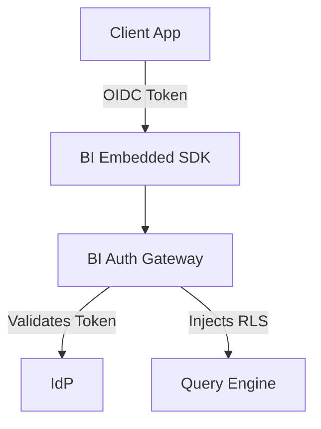

# BI Integration Guide

## Deep Architectural Analysis
Integrating BI tools with Identity Providers (IdP) via SAML/OIDC and embedding them via IFrames or SDKs requires handling Cross-Origin Resource Sharing (CORS) and secure token exchange. Row-Level Security (RLS) policies are injected dynamically during token validation.

## Code Implementation
```python
# Decoding JWT to enforce RLS in superset config
def get_rls_filters(user_token):
    payload = jwt.decode(user_token, SECRET_KEY, algorithms=["HS256"])
    tenant_id = payload.get("tenant_id")
    return f"tenant_id = '{tenant_id}'"
```

## System Architecture


## Mathematical Formulas Explaining Thresholds
Token Expiration Buffer:
$$ T_{buffer} = T_{expiry} - (L_{network} \times 3) - S_{skew} $$
Ensures tokens are refreshed before hard expiration accounting for clock skew.
