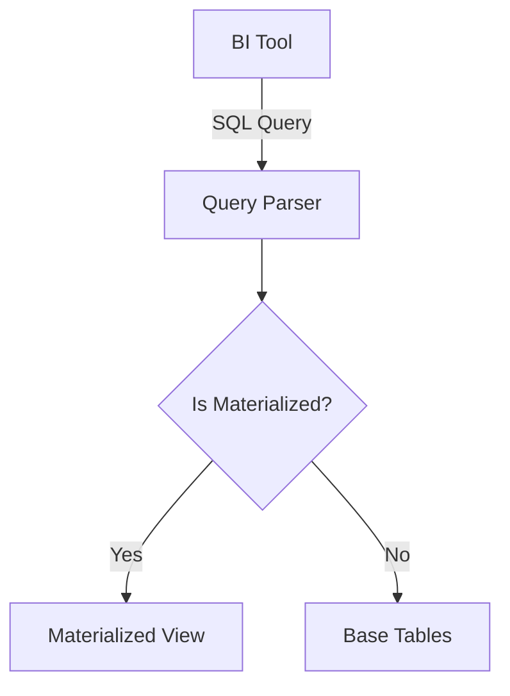

# BI Performance Tuning

## Deep Architectural Analysis
BI performance optimization focuses on pre-aggregating materialized views, tuning JDBC/ODBC fetch sizes, and optimizing query ASTs. We utilize columnar indexing and predicate pushdown to ensure the underlying Data Warehouse minimizes full table scans during interactive slice-and-dice operations.

## Code Implementation
```sql
-- Creating an optimized Materialized View for BI
CREATE MATERIALIZED VIEW mv_sales_dashboard
BACKED BY iceberg
AS SELECT 
    store_id, 
    date_trunc('day', transaction_time) as tx_day,
    SUM(amount) as daily_total
FROM raw_transactions
GROUP BY 1, 2
WITH NO DATA;
```

## System Architecture


## Mathematical Formulas Explaining Thresholds
Optimal Fetch Size ($F_{opt}$) for JDBC:
$$ F_{opt} = \frac{B_{network}}{R_{size} \times RTT} $$
Balancing network bandwidth, row size, and Round Trip Time.
