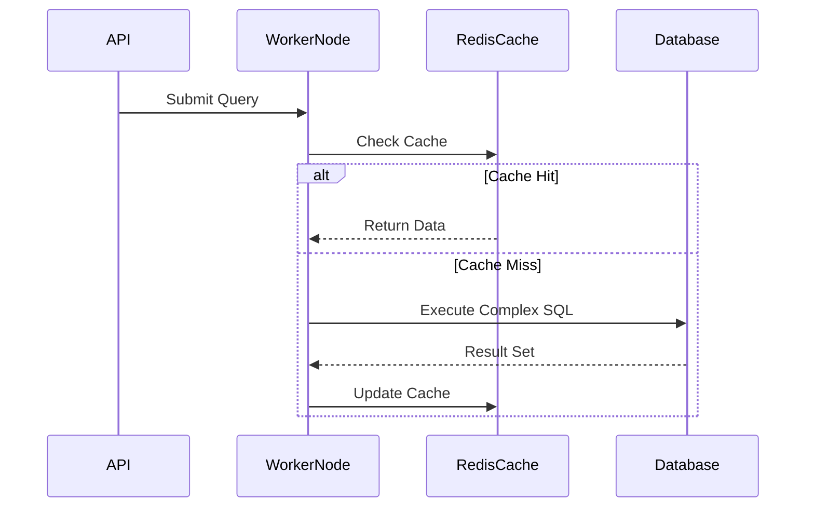
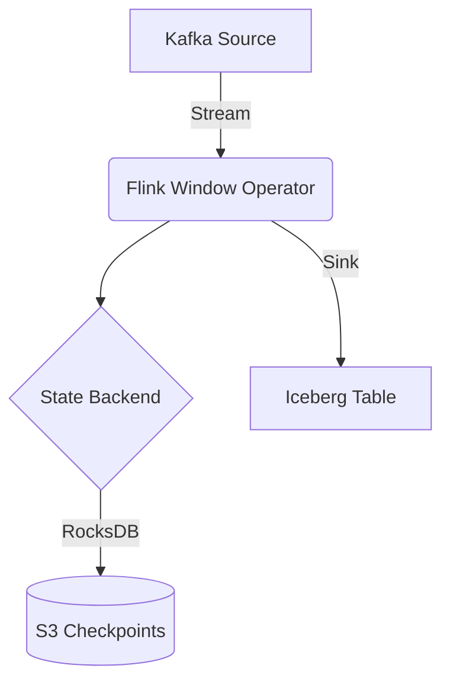

# Performance Tuning for Data Bi Tools

## 1. Advanced Strategy and Execution

To optimize **Performance Tuning**, we enforce the following foundational rules:

- **Parallel Processing**: Aligns consumer threads with partition counts to maximize throughput.
- **Backpressure Mechanisms**: Propagates limits upstream to prevent OutOfMemory crashes.
- **Eventual Consistency**: Employs background anti-entropy for synchronization.
- **ELT Paradigm Shift**: Utilizes massively parallel processing engines for SQL transformations.
- **Columnar Storage (Parquet/ORC)**: Drastically reduces disk I/O through projection pushdown.

### Core Implementation

```sql
CREATE TABLE iceberg_catalog.db.sales (
    id BIGINT,
    amount DECIMAL(10,2),
    event_time TIMESTAMP
) USING iceberg
PARTITIONED BY (days(event_time));
```


---

## 2. Advanced Strategy and Execution

To optimize **Performance Tuning**, we enforce the following foundational rules:

- **Compute/Storage Separation**: Allows infinite concurrent scaling via independent virtual warehouses.
- **Consistent Hashing**: Minimizes data movement when scaling cluster nodes.
- **Columnar Storage (Parquet/ORC)**: Drastically reduces disk I/O through projection pushdown.
- **Index-free Adjacency**: Ensures $O(1)$ relationship traversal in graph networks.

### Mathematical Thresholds
$$ \text{Query Time} \approx O(\log N) \text{ using B-Tree indexes, compared to } O(N) \text{ for full table scans} $$

---

## 3. Advanced Strategy and Execution

To optimize **Performance Tuning**, we enforce the following foundational rules:

- **CAP Theorem Trade-offs**: Balances Consistency, Availability, and Partition Tolerance.
- **Resilient Distributed Datasets**: Achieves fault tolerance through deterministic lineage graphs.
- **Backpressure Mechanisms**: Propagates limits upstream to prevent OutOfMemory crashes.
- **Data Quality Assertions**: Prevents pipeline corruption via schema validation.

### System Architecture




---

## 4. Advanced Strategy and Execution

To optimize **Performance Tuning**, we enforce the following foundational rules:

- **Star Schema Design**: Denormalizes tables to minimize join operations.
- **CAP Theorem Trade-offs**: Balances Consistency, Availability, and Partition Tolerance.
- **Vectorized Query Engines**: Exploits SIMD instructions for rapid batch data execution.
- **Eventual Consistency**: Employs background anti-entropy for synchronization.
- **Data Mesh Paradigm**: Decentralizes ownership into domain-oriented data products.

### Mathematical Thresholds
$$ \mathcal{L}_{checkpoint} = \sum_{i=1}^{N} \frac{1}{B} \int_{t=0}^{T} || S_i(t) - S_{commit}(t) ||_2^2 dt $$

---

## 5. Advanced Strategy and Execution

To optimize **Performance Tuning**, we enforce the following foundational rules:

- **ACID Transactions on Object Storage**: Leverages Apache Iceberg for concurrent schema evolution.
- **Eventual Consistency**: Employs background anti-entropy for synchronization.
- **Index-free Adjacency**: Ensures $O(1)$ relationship traversal in graph networks.

### Core Implementation

```python
def process_rdd(rdd):
    # Perform complex distributed transformations
    return rdd.filter(lambda x: x['status'] == 'ACTIVE') \
              .map(lambda x: (x['user_id'], x['amount'])) \
              .reduceByKey(lambda a, b: a + b) \
              .filter(lambda x: x[1] > 1000)
```


---

## 6. Advanced Strategy and Execution

To optimize **Performance Tuning**, we enforce the following foundational rules:

- **Resilient Distributed Datasets**: Achieves fault tolerance through deterministic lineage graphs.
- **Idempotent Operations**: Guarantees safe retries during distributed pipeline failures.
- **Consistent Hashing**: Minimizes data movement when scaling cluster nodes.

### System Architecture


---

## 7. Advanced Strategy and Execution

To optimize **Performance Tuning**, we enforce the following foundational rules:

- **ACID Transactions on Object Storage**: Leverages Apache Iceberg for concurrent schema evolution.
- **Idempotent Operations**: Guarantees safe retries during distributed pipeline failures.
- **ELT Paradigm Shift**: Utilizes massively parallel processing engines for SQL transformations.
- **Index-free Adjacency**: Ensures $O(1)$ relationship traversal in graph networks.

### Core Implementation

```sql
CREATE TABLE iceberg_catalog.db.sales (
    id BIGINT,
    amount DECIMAL(10,2),
    event_time TIMESTAMP
) USING iceberg
PARTITIONED BY (days(event_time));
```


---

## 8. Advanced Strategy and Execution

To optimize **Performance Tuning**, we enforce the following foundational rules:

- **ELT Paradigm Shift**: Utilizes massively parallel processing engines for SQL transformations.
- **Compute/Storage Separation**: Allows infinite concurrent scaling via independent virtual warehouses.
- **Columnar Storage (Parquet/ORC)**: Drastically reduces disk I/O through projection pushdown.
- **Vectorized Query Engines**: Exploits SIMD instructions for rapid batch data execution.

### Mathematical Thresholds
$$ P(failure) = 1 - (1 - p)^n \implies \text{High availability requires replication factor } n \ge 3 $$

---

## 9. Advanced Strategy and Execution

To optimize **Performance Tuning**, we enforce the following foundational rules:

- **Index-free Adjacency**: Ensures $O(1)$ relationship traversal in graph networks.
- **CAP Theorem Trade-offs**: Balances Consistency, Availability, and Partition Tolerance.
- **Idempotent Operations**: Guarantees safe retries during distributed pipeline failures.
- **Columnar Storage (Parquet/ORC)**: Drastically reduces disk I/O through projection pushdown.
- **Data Quality Assertions**: Prevents pipeline corruption via schema validation.

### System Architecture


---

## 10. Advanced Strategy and Execution

To optimize **Performance Tuning**, we enforce the following foundational rules:

- **Parallel Processing**: Aligns consumer threads with partition counts to maximize throughput.
- **Vectorized Query Engines**: Exploits SIMD instructions for rapid batch data execution.
- **Star Schema Design**: Denormalizes tables to minimize join operations.
- **ACID Transactions on Object Storage**: Leverages Apache Iceberg for concurrent schema evolution.

### Mathematical Thresholds
$$ \mathcal{L}_{checkpoint} = \sum_{i=1}^{N} \frac{1}{B} \int_{t=0}^{T} || S_i(t) - S_{commit}(t) ||_2^2 dt $$

---

## 11. Advanced Strategy and Execution

To optimize **Performance Tuning**, we enforce the following foundational rules:

- **Eventual Consistency**: Employs background anti-entropy for synchronization.
- **Parallel Processing**: Aligns consumer threads with partition counts to maximize throughput.
- **ELT Paradigm Shift**: Utilizes massively parallel processing engines for SQL transformations.
- **Index-free Adjacency**: Ensures $O(1)$ relationship traversal in graph networks.
- **Consistent Hashing**: Minimizes data movement when scaling cluster nodes.

### Core Implementation

```python
def process_rdd(rdd):
    # Perform complex distributed transformations
    return rdd.filter(lambda x: x['status'] == 'ACTIVE') \
              .map(lambda x: (x['user_id'], x['amount'])) \
              .reduceByKey(lambda a, b: a + b) \
              .filter(lambda x: x[1] > 1000)
```


---

## 12. Advanced Strategy and Execution

To optimize **Performance Tuning**, we enforce the following foundational rules:

- **Columnar Storage (Parquet/ORC)**: Drastically reduces disk I/O through projection pushdown.
- **ACID Transactions on Object Storage**: Leverages Apache Iceberg for concurrent schema evolution.
- **Consistent Hashing**: Minimizes data movement when scaling cluster nodes.
- **ELT Paradigm Shift**: Utilizes massively parallel processing engines for SQL transformations.
- **Resilient Distributed Datasets**: Achieves fault tolerance through deterministic lineage graphs.

### System Architecture


---

## 13. Advanced Strategy and Execution

To optimize **Performance Tuning**, we enforce the following foundational rules:

- **Data Quality Assertions**: Prevents pipeline corruption via schema validation.
- **ACID Transactions on Object Storage**: Leverages Apache Iceberg for concurrent schema evolution.
- **Compute/Storage Separation**: Allows infinite concurrent scaling via independent virtual warehouses.

### Core Implementation

```sql
CREATE TABLE iceberg_catalog.db.sales (
    id BIGINT,
    amount DECIMAL(10,2),
    event_time TIMESTAMP
) USING iceberg
PARTITIONED BY (days(event_time));
```


---

## 14. Advanced Strategy and Execution

To optimize **Performance Tuning**, we enforce the following foundational rules:

- **ACID Transactions on Object Storage**: Leverages Apache Iceberg for concurrent schema evolution.
- **Resilient Distributed Datasets**: Achieves fault tolerance through deterministic lineage graphs.
- **Vectorized Query Engines**: Exploits SIMD instructions for rapid batch data execution.
- **Compute/Storage Separation**: Allows infinite concurrent scaling via independent virtual warehouses.
- **Columnar Storage (Parquet/ORC)**: Drastically reduces disk I/O through projection pushdown.

### Mathematical Thresholds
$$ \text{Query Time} \approx O(\log N) \text{ using B-Tree indexes, compared to } O(N) \text{ for full table scans} $$

---

## 15. Advanced Strategy and Execution

To optimize **Performance Tuning**, we enforce the following foundational rules:

- **Resilient Distributed Datasets**: Achieves fault tolerance through deterministic lineage graphs.
- **Eventual Consistency**: Employs background anti-entropy for synchronization.
- **Compute/Storage Separation**: Allows infinite concurrent scaling via independent virtual warehouses.
- **CAP Theorem Trade-offs**: Balances Consistency, Availability, and Partition Tolerance.
- **Index-free Adjacency**: Ensures $O(1)$ relationship traversal in graph networks.

### System Architecture




---
