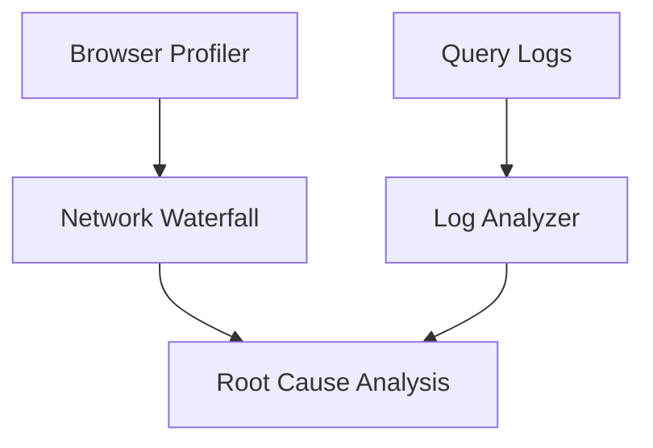

# BI Troubleshooting Guide

## Deep Architectural Analysis
Troubleshooting BI platforms requires isolating UI rendering bottlenecks from backend query latency. Using Chrome DevTools for the frontend and slow query logs for the database, we identify Cartesian products in user-generated SQL or unoptimized DAX measures causing exponential computational complexity.

## Code Implementation
```python
# Parsing slow query logs
import re
def find_slow_queries(log_file):
    slow_pattern = re.compile(r"Query Time: (\d+)ms.*?(SELECT.*)", re.IGNORECASE)
    with open(log_file) as f:
        for line in f:
            match = slow_pattern.search(line)
            if match and int(match.group(1)) > 5000:
                print(f"Slow Query: {match.group(2)}")
```

## System Architecture


## Mathematical Formulas Explaining Thresholds
Render timeout constraint:
$$ T_{render} = N_{widgets} \times (t_{query} + t_{draw}) $$
If $T_{render} > 10s$, dashboard pagination or simplification is required.
