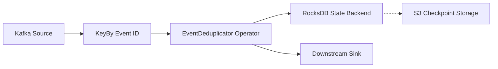

# Distributed Compute API Reference

## 1. Apache Flink Stateful Processing API

### Architectural Context
Stateful stream processing APIs enable operators to retain data across events. Proper use of Flink's `ValueState`, `MapState`, and `ListState` is crucial for avoiding OOM errors and maintaining high throughput.

### Mathematical Thresholds
State size estimation for a single operator:
$$ S_{total} = \sum_{i=1}^{N_{keys}} (S_{key_i} + S_{value_i} + C_{overhead}) $$
If $S_{total} > M_{rocksdb\_block\_cache}$, RocksDB will increasingly read from SST files on disk, leading to IO bottlenecks.

### Implementation (Java)
```java
public class EventDeduplicator extends KeyedProcessFunction<String, Event, Event> {
    private ValueState<Boolean> seenState;

    @Override
    public void open(Configuration parameters) {
        StateTtlConfig ttlConfig = StateTtlConfig.newBuilder(Time.hours(24))
            .setUpdateType(StateTtlConfig.UpdateType.OnCreateAndWrite)
            .setStateVisibility(StateTtlConfig.StateVisibility.NeverReturnExpired)
            .build();
        ValueStateDescriptor<Boolean> desc = new ValueStateDescriptor<>("seen", Boolean.class);
        desc.enableTimeToLive(ttlConfig);
        seenState = getRuntimeContext().getState(desc);
    }

    @Override
    public void processElement(Event event, Context ctx, Collector<Event> out) throws Exception {
        if (seenState.value() == null) {
            seenState.update(true);
            out.collect(event);
        }
    }
}
```

### Flow Diagram

