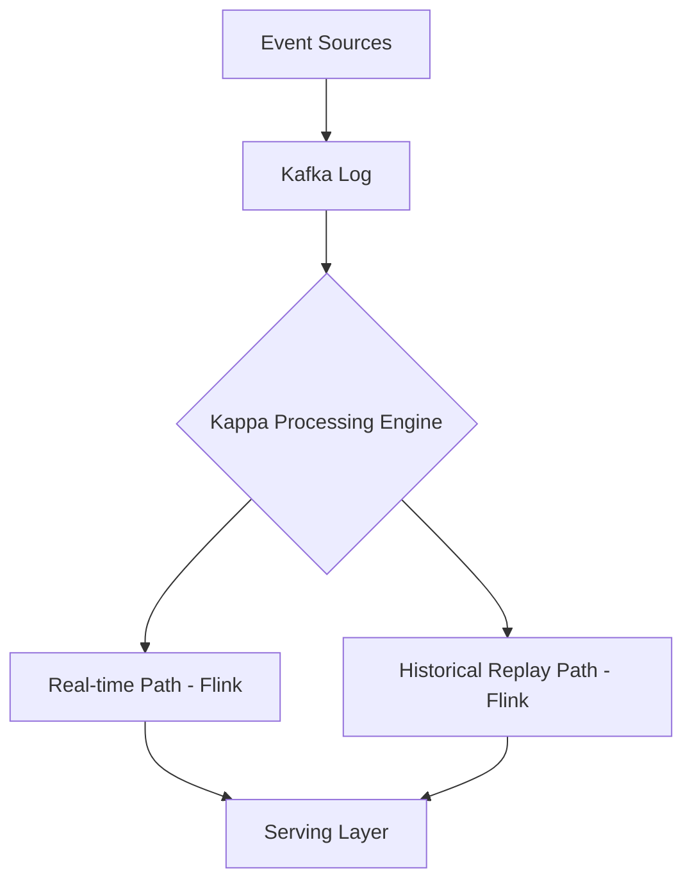

# Distributed Compute Architecture Patterns

## 1. Kappa vs. Lambda Architecture

### Architectural Context
Modern distributed data processing systems often standardize on the **Kappa Architecture**, eliminating the dual-codebase maintenance of the Lambda architecture by using a single stream processing engine (like Flink) for both realtime and backfill workloads.

### Mathematical Thresholds
Latency vs Throughput trade-off formula:
$$ T = \frac{B_{size}}{L_{target} + C_{network}} $$
Where $T$ is throughput, $B_{size}$ is micro-batch size (for systems like Spark Structured Streaming), and $L_{target}$ is the target latency.

### Implementation (PySpark)
A unified PySpark script handling both streaming and batch modes based on a configuration flag.
```python
from pyspark.sql import SparkSession

def process_data(spark: SparkSession, is_streaming: bool):
    if is_streaming:
        df = spark.readStream.format("kafka").option("subscribe", "topic_A").load()
        # Streaming transformations
        query = df.writeStream.format("delta").outputMode("append").start("/lake/table")
        query.awaitTermination()
    else:
        df = spark.read.format("kafka").option("subscribe", "topic_A").load()
        # Batch transformations
        df.write.format("delta").mode("append").save("/lake/table")
```

### System Architecture

