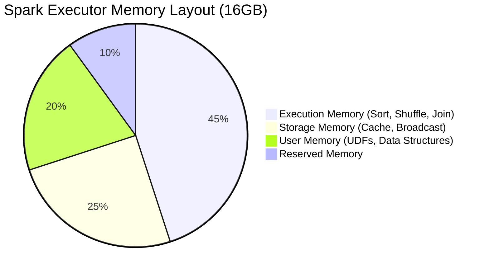

# Distributed Compute Configuration Guide

## 1. JVM Memory Tuning for Spark & Flink

### Architectural Context
Distributed JVM compute frameworks segment memory into Execution, Storage, and User memory. Misconfiguration leads to GC pauses or Container killed by YARN/K8s (OOMKilled).

### Mathematical Thresholds
Spark Unified Memory calculation:
$$ M_{usable} = (M_{system} - M_{reserved}) \times F_{fraction} $$
Where $M_{reserved}$ is typically 300MB, and $F_{fraction}$ is `spark.memory.fraction` (default 0.6).
Storage Memory bound:
$$ M_{storage} = M_{usable} \times F_{storageFraction} $$

### Implementation (Configuration YAML)
Spark properties for GC optimization (G1GC):
```properties
spark.executor.memory 16g
spark.executor.memoryOverhead 2g
spark.memory.fraction 0.7
spark.memory.storageFraction 0.4
spark.executor.extraJavaOptions -XX:+UseG1GC -XX:InitiatingHeapOccupancyPercent=35 -XX:MaxGCPauseMillis=200
```

### System Architecture

