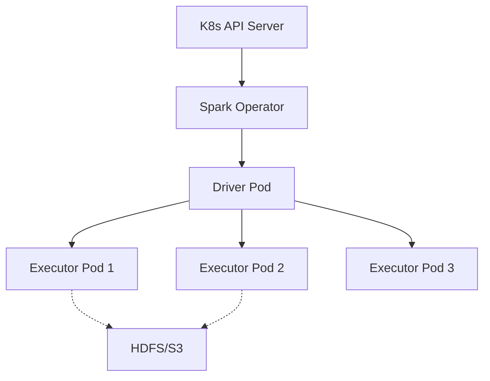

# Distributed Compute Deployment Strategies

## 1. Kubernetes Native Deployments

### Architectural Context
Running Apache Spark and Flink natively on Kubernetes allows for resource isolation, declarative deployments (CRDs), and seamless integration with cloud-native monitoring (Prometheus/Grafana).

### Mathematical Thresholds
Pod resource allocation constraint to avoid noisy neighbors:
$$ CPU_{limit} \le CPU_{node\_total} - CPU_{daemonsets} $$
$$ Mem_{limit} = Mem_{jvm\_heap} + Mem_{off\_heap} + Mem_{python\_worker} $$

### Implementation (YAML)
SparkApplication CRD (using Google's Spark on K8s Operator):
```yaml
apiVersion: "sparkoperator.k8s.io/v1beta2"
kind: SparkApplication
metadata:
  name: spark-pi
  namespace: data-processing
spec:
  type: Scala
  mode: cluster
  image: "gcr.io/spark-operator/spark:v3.1.1"
  mainClass: org.apache.spark.examples.SparkPi
  mainApplicationFile: "local:///opt/spark/examples/jars/spark-examples_2.12-3.1.1.jar"
  driver:
    cores: 1
    coreLimit: "1200m"
    memory: "512m"
  executor:
    instances: 3
    cores: 1
    memory: "512m"
```

### System Architecture

